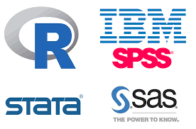
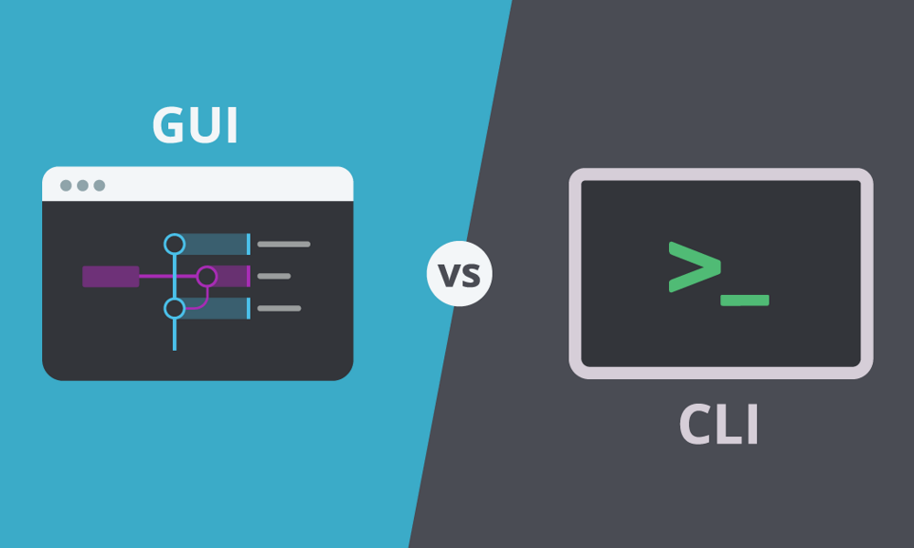
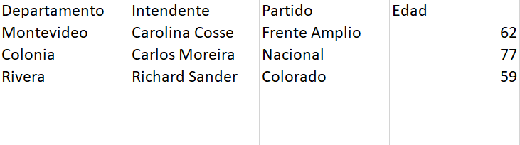

class: inverse, center, middle

```{r setup, include=FALSE, warning=FALSE}
library(xaringanthemer)
library(kableExtra)
library(xaringan)
library(xaringanExtra)

style_duo_accent(primary_color = "#0E6251",
                 secondary_color = "#507786",
                 text_font_family = "Droid Serif",
                 text_font_url = "https://fonts.googleapis.com/css?family=Droid+Serif:400,700,400italic",
                 header_font_google = google_font("Yanone Kaffeesatz"),
                 text_slide_number_color = "#000000")
knitr::opts_chunk$set(echo = FALSE)
options("kableExtra.html.bsTable" = T)

htmltools::tagList(
  xaringanExtra::use_clipboard(
    button_text = "<i class=\"fa fa-clipboard\"></i>",
    success_text = "<i class=\"fa fa-check\" style=\"color: #90BE6D\"></i>",
    error_text = "<i class=\"fa fa-times-circle\" style=\"color: #F94144\"></i>"
  ),
  rmarkdown::html_dependency_font_awesome()
)
use_xaringan_extra(c("tile_view", "animate_css", "tachyons"))
use_scribble()
use_extra_styles(
  hover_code_line = TRUE,         
  mute_unhighlighted_code = TRUE
  )  
```
# Introducción a R y RStudio

---
## Introducción a R y RStudio

- **Tres objetivos**

--

  - Introducción
  - Manipulación de datos (básico)
  - Análisis de datos (básico)

--

- **Cada clase**

--

  - Presentación
  - Código de la clase
  - Ejercicio
  - Solución del ejercicio

--

- **Enfoque _"hands on"_**

--

- **Curva de aprendizaje empinada**

---

## Algunos ejemplos simples del potencial de R

- **Extracción y Análisis de datos** 

--

  - [Speech](https://nicolas-schmidt.github.io/speech/index.html)
  - [Speech - Ejemplos](https://github.com/Nicolas-Schmidt/speech-ejemplos?tab=readme-ov-file#ejemplo-1)

--

- **Visualización de datos**

--

  - [UMAD - Data electoral y op](https://bancodedatos-fcs.shinyapps.io/appPolitica/)

--

- **Elaboración de documentos** 

--

  - [UMAD - Datos Electorales](https://umad-fcs.github.io/Piso-I-Politica/)

--

- **Extracción + análisis + visualización + Documento**

--

  - [Ejemplo de flujo](https://gmendezbarbato.github.io/myd2024/whisper_manini.html)

---
class: inverse, center, middle

# Plan para hoy


---

## Introducción

- **Programación y ¿Qué es R y Rstudio?**

- **Consejos**

- **Primeros pasos**

- **Lenguaje básico en R**

- **Objetos**

- **Vectores**

- **Dataframes**

- **Funciones**

- **Paquetes**

- **Dialectos**

- **Ejercicio**

---
class: inverse, center, middle

# Programación y ¿Qué es R?


---

## Softwares estadísticos

Los softwares o paquetes estadísticos son programas informáticos diseñado para llevar a cabo análisis estadísticos. Algunos de los más utilizados son SPSS, Stata, SAS o R. 

.center[
```{r, out.width = "350px"}

```
]

.right[Fuente: R4DS]

---

## ¿Por qué usar R?

- Es un software libre y gratuito

--

- Generar nuevas funciones es fácil, por lo que las está en constante desarrollo

--

- Tiene muchos usuarios de diversas disciplinas lo que genera una comunidad (particularmente mediante foros) que es de gran utilidad para la resolución de problemas de código

--

- Es uno de los programas más utilizados para técnicas innovadaras en estadística y visualización de datos 

--

- Trabaja muy bien con otros programas/lenguajes (Excel, Latex, HTML, etc.)

--

- Es cada vez más usado tanto en el ámbito académico como profesional

--

- Es versátil y permite integrar la mayor parte de las actividades que un/a investigador/a realiza cotidianamente en un flujo ordenado

---

## Modalidades de uso de softwares estadísticos

- Point and click o GUI (Interfaz gráfica del usuario)

- Programación 

.center[
```{r, out.width = "400px"}

```
]

---

## ¿Por qué programar?

- **Eficiencia:** Si bien programar llevará más tiempo al principio, rápidamente permite ahorrar mucho tiempo en comparación a tareas realizadas a través de una interfaz gráfica. 
--

- **Más posibilidades:** En los softwares estadísticos tradicionales muchas operaciones (las más complejas o especificas) suelen no estar disponibles en la interfaz gráfica por lo que solo se pueden realizar mediante el uso de código.  

--
- **Recolección de datos:** Saber programar abre la posibilidad para la recolección de datos que no es posible o es muy costosa manualmente.

--
- **Reproducibilidad:** El análisis de datos mediante programación mejora la transparencia y reproducibilidad en el proceso de generación de conocimiento

--
- **Colaboración:** La programación abre la puerta para una colaboración mucho más sencilla y eficiente. 


---

## R y R Studio

.pull-left[

- R es un software y un lenguaje de programación gratuito enfocado en el análisis estadístico y la visualización de datos.

- R cuenta con gran potencia y flexibilidad, así como una numerosa -y creciente- comunidad de usuarios tanto académicos como profesionales.

.center[
```{r, out.width = "150px"}
knitr::include_graphics("ima/Rlogo.png")
```
]]

.pull-right[
- R Studio es un entorno de desarrollo integrado (IDE) . O en otras palabras... es una interfaz un poco (bastante) más amigable que usar R directamente.

.center[
```{r, out.width = "200px"}
knitr::include_graphics("ima/rstudio.png")
```
]]


---
## Bibliografía


-	Llaudet, E., & Imai, K. (2022). *Data analysis for social science: A friendly and practical introduction.* Princeton University Press. Introducción.
  - [Enlace](https://eva.fcs.udelar.edu.uy/pluginfile.php/227512/mod_folder/content/0/3.%20Data%20Analysis%20for%20Social%20Science%20%28Elena%20Llaudet%2C%20Kosuke%20Imai%29.pdf)


-	Wickham, H., Çetinkaya-Rundel, M., & Grolemund, G. (2023). *R for data science.* O'Reilly Media, Inc. 
  - [Enlace inglés](https://r4ds.had.co.nz/) 
  - [Enlace español](https://es.r4ds.hadley.nz/)

---
## Bibliografía

### Data analysis for social science...

--

Van a encontrar una explicación sencilla y código para el inicio:
.small[
- Qué es R
- Cómo se instala R y RStudio
- Comandos básicos iniciales
  - Usar R como calculadora
  - Crear objetos
  - Aplicar funciones
  - Setear directorio
  - Cargar bases de datos
  - Etc.
- Estructura típica de base de datos (dataframes)
- Tipos de variables
- Ejercicios
- Cuadros resumen de síntesis (cheatshhet)
  -	Términos
  - Símbolos
  - Funciones
]

---

## Bibliografía

### Data analysis for social science...

#### [Ventajas]
- Hadley Wickham y Tidyverse
- Está en español (no es una traducción automatizada)
- Está orientado al uso y las explicaciones son sencillas ("no la complica")
- Es un libro online (hecho con R y blogdown) y tiene una interfaz muy amigable para recorrerlo

--

#### [Desventajas]
-	Los ejemplos tienen poca relación con ciencias sociales
-	La estructura no responde a la lógica de la investigación científica


---

## Bibliografía

### R para ciencia de datos

#### [Ventajas]
- Libro aplicado a Ciencias Sociales (dejamos en bibliografía el texto completo).
- Seguramente se utilice en cursos futuros del vector
- Utiliza mayoritariamente código de R base.

--

#### [Desventajas]
- Está en inglés
- Está escaneado (no funcionan los links ni se puede copiar texto y código)

---

## Recursos complementarios

La comunidad de usuarios de R es inmensa y muy abierta. Por esto hay muchísimos recursos para aprender de forma independiente y resolver problemas cuando nos estancamos:


- [R Bloggers](https://www.r-bloggers.com/) y [rpubs](https://rpubs.com/) publican miles de tutoriales para temas específicos 

- Existen foros -por ej. [Stack Overflow](https://stackoverflow.com/)- donde responden una infinidad preguntas de programación en R. 

- [IntRo](https://github.com/Nicolas-Schmidt/IntRo) es un excelente curso de R a cargo de Nicolás Schmidt  de Facultad de Ciencias Sociales

- [AnalizaR](https://arcruz0.github.io/libroadp/index.html) es un libro sobre análisis de datos en R con énfasis en Ciencia Política 

---

class: inverse, center, middle

# Primeros pasos

<!-- --- -->
<!-- class: inverse, center, middle -->


<!-- # Cuatro consejos (Nicolás Schmidt - IntRo R) -->

<!-- --- -->

<!-- ## 1. Potencial   -->

<!-- -- -->

<!-- **Mostrar la mejor versión de R** -->

<!-- -- -->

<!--   → Estadística: frecuentista y bayesiana -->

<!--   → Gráficos de alta calidad: estáticos, animados e interactivos.   -->

<!--   → Crear una pagina web   -->

<!--   → Git   -->

<!--   → Escribir un libro: markdown, LATEX   -->

<!--   → Hacer presentaciones: markdown, LATEX   -->

<!--   → Escribir un paper   -->

<!--   → Gestionar y mandar mails   -->

<!--   → Crear gif   -->

<!--   → Jugar: packman, prince...   -->

<!--   → Ver videos de YouTube   -->

<!-- --- -->

<!-- ## 2. Sinceridad -->

<!-- -- -->

<!-- **No es fácil aprender R y generar un mínimo de autonomía.** -->

<!-- -- -->

<!--   → Continentar al estudiante en relación a los errores.   -->

<!--   → Dedicarle mucho tiempo a los mecanismos para obtener ayuda, los recursos disponibles y la mayor cantidad de atajos posibles para controlar la frustración.   -->

<!-- --- -->

<!-- ## 3. Emular -->

<!-- -- -->

<!-- **Emular y estimular con el curso el uso frecuente de R** -->

<!-- -- -->

<!--   → Uso de Git    -->

<!--   → Descarga de versiones de paquetes    -->

<!--   → Tener que usar R para todo lo relativo a un curso    -->


<!-- --- -->

<!-- ## 4. Fundamentos -->

<!-- -- -->

<!-- **No iniciar con aplicaciones!** -->

<!-- -- -->

<!--   → La persona que se inicia en R va a querer aplicar la herramienta a sus  problemas: leer datos, hacer descriptivos, hacer un gráfico...   -->

<!--   → Hacer eso es evadir la frustración!   -->

<!--   → R ES un lenguaje de programación. Problemas complejos soluciones complejas.   -->


---

## Abrimos R Studio 
.center[
```{r, out.width = "1000px"}
knitr::include_graphics("ima/consola_standard.png")
```
]
---

## R Studio

- .bold[Source (editor):] es donde creamos y editamos los scripts, es decir, donde escribimos y almacenamos el código.

- .bold[Console (consola):] imprime el código que corremos y la mayoría de los resultados. Podemos escribir código directamente aquí  también, aunque si queremos guardarlo lo recomendable es hacerlo en el script.

- .bold[Environment (ambiente):] Muestra todos los objetos que creaste en cada sesión.

- .bold[Gráficos (y más):] Imprime los gráficos. En el mismo panel figuran otras pestañas como "Help" que sirve para buscar ayuda.

---

## Scripts 

- Es un archivo de texto con el código y anotaciones. 

- Se crea arriba a la izquierda "file/New File/R Script" o `ctrl + shift + n`. 

- Se guarda con `ctrl + s` y es un documento de texto como cualquier otro (word, txt). Esto nos permite reproducir paso a paso todo lo que hicimos durante nuestro análisis.

- Haciendo click luego en el script guardado se inicia R Studio. 

- Para ejecutar una línea de código pueden usar el botón de "Run" arriba a la derecha o -más cómodo- `ctrl + enter`

--

### Ahora ingresen/descarguen la carpeta de eva Codigo Clase 1 y abran el archivo codigo_1.R 

---

## Anotaciones

- Es importante ser prolijo y cuidadoso con el código que escribimos
- Los scripts nos dan la posibilidad de incluir comentarios, lo que es muy útil:

```{r ej3, echo = TRUE}
## Esta línea es una anotación. 

## R ignora todo lo que está acá adentro (tiene que empezar con #)

## Podemos escribir nombres de funciones u objetos y R no las va a
# interpetar

## Usar anotaciones es clave para poder entender qué fue lo que
# hicimos anteriormente
```

- De esta forma, podemos comentar que fue lo que hicimos para acordarnos nosotros, y que los demás entiendan

---

## Ayuda  

- Obtener la ayuda correcta es fundamental al programar en R. Podemos obtener ayuda de todas las funciones que utilizamos con el comando `help()` (ej. `help(mean)`) o `?` (ej. `?mean`)

- Si no podemos solucionar un error con la documentación de las funciones/paquetes muchas veces sirve buscar en un navegador 

- Muchas páginas contienen información relevante para solucionar problemas, entre las que se destaca [stackoverflow](https://stackoverflow.com/questions/tagged/r)

- En caso de no encontrar solución se puede consultar en páginas como stackoverflow mediante un [ejemplo reproducible o reprex](https://stackoverflow.com/questions/5963269/how-to-make-a-great-r-reproducible-example)

---

## Ayuda

```{r ej9bb2_e3, echo = TRUE, eval = FALSE}
help(mean)
```

.center[
```{r, out.width = "1000px"}
knitr::include_graphics("ima/ima_mean.jpeg")
```
]

      
---
class: inverse, center, middle

# Lenguaje básico de R

---

## R como calculadora 

Para empezar, R sirve como calculadora. Se pueden realizar operaciones matemáticas, por ejemplo:

.codefont[
```{r ej5x, echo = TRUE}
# Operaciones sencillas
2 + 2  
20 - 10
10 / 2
10 * 10
```
]

--

- [**Operadores en R**](https://gmendezbarbato.github.io/myd2024/documentos-markdown/operadores.html)

---

## Objetos en R
En muchos programas estadísticos solemos solamente "imprimir" resultados (lo que llamamos expresiones). En R podemos utilizar este enfoque:

```{r ej5, echo = TRUE}
# Una operación sencilla:
17*17*7 # Se imprime el resultado
```

Sin embargo, en R también podemos almacenar los resultados en objetos. Creamos los objetos mediante asignaciones (`<-`). En este caso, guardemos el valor (a diferencia de imprimirlo). 

```{r ej5b, echo = TRUE}
anio <- 17*17*7 # Se crea un objeto
```

Si a esto lo ponemos entre paréntesis combinamos ambos enfoques: se guarda el objeto y se imprime el resultado

```{r ej5z, echo = TRUE}
(anio <- 17*17*7) # Se crea un objeto y se imprime
```
---

## Asignaciones 

- El símbolo para crear un objeto es ` <-` (alt + -) y se llama asignador
- Las asignaciones se crean de la siguiente manera: nombre_del_objeto `<-` valor.  
- Como vimos, una vez que creo un objeto, R (por defecto) no imprime su valor. Este se puede obtener escribiendo simplemente el nombre del objeto o mediante la función `print()`:

.codefont[
```{r ej5c, echo = TRUE}
anio <- 17*17*7 # Se crea un objeto

anio # Imprime el objeto anio

print(anio) # Imprime el objeto anio
```
]

---

## Algunas funciones básicas

```{r ej5c2, echo = TRUE, eval = FALSE}
ls() # Lista los objetos en el ambiente

rm(year) # Borra objeto del ambiente

rm(list=ls()) # Borra todos los objetos del ambiente

help(ls) # Buscar ayuda sobre una función
```

---
class: inverse, center, middle

# Objetos 

---

## Clases y tipos de objetos

- En R utilizamos constantemente objetos. Cada objeto tiene una clase, tipo y atributos. 

- Esto es importante porque las funciones que podemos aplicar a nuestros datos dependen del objeto en el que los definimos.

- El uso de objetos tiene muchos benificios como extraer parte de ellos para determinados usos, duplicarlos o realizar operaciones sin imprimir en la consola.

---

## Tipos de objetos

El tipo de un objeto refiere a cuál es el tipo de los datos dentro del objeto. Los tipos más comunes son:
 
```{r t1, echo = FALSE, results="hide"}
Nombre <- c("integer", "double", "character", "logical")
Tipos <- c("Númerico: valores enteros", "Númerico: valores reales", "Texto", "Lógico (TRUE or FALSE)")
Ejemplo <- c(10, 10.5, '"Diez"', TRUE)
tabla1 <- data.frame(cbind(Nombre, Tipos, Ejemplo))
```
 
```{r t1_c, echo = FALSE}
tabla1 %>%
  kbl() %>%
  kable_styling(bootstrap_options = c("striped", "hover", "condensed"), font_size = 20)
```

---

## Clases o estructura de datos

Las clases de objetos son formas de representar datos para usarlos de forma eficiente. Se dividen en cuántas dimensiones tienen y si poseen distintos tipos de datos o no. Las clases de datos más comunes en R son: 

- `vector` (vectores): es la forma más simple, son unidimensionales y de un solo tipo

- `lists` (listas): son unidimensionales pero no están restringidas a un solo tipo de datos

- `matrix` (matrices): tienen dos dimensiones (filas y columnas) y un solo tipo de datos. 

- `dataframes` (marcos de datos): son el tipo de estructura al que más acostumbrado estamos, con dos dimensiones (filas y columnas) y puede incluir distintos tipos de datos (uno por columna). Pueden considerarse como listas de vectores con el mismo tamaño. 


En ocasiones podemos transformar objetos de una clase a otra.


---
## Clases y tipos de objetos

.center[
```{r ej5434, out.width = "800px"}
knitr::include_graphics("ima/sch.jpg")
```
]

.right[ R variables and data types: Introduction to R Programming, Sydney-Informatics
]


---

## Funciones para explorar objetos

R tiene funciones que nos permiten identificar la clase, el tipo, la estructura y los atributos de un objeto.

- `class()` - ¿Qué tipo de objeto es?

- `typeof()` - ¿Qué tipos de data tiene el objeto?

- `length()` - ¿Cuál es su tamaño?

- `attributes()` - ¿Tiene metadatos?

- `str()` (paquete `utils`) - ¿CUál es la estructura interna del objeto?

---

## ¿Por qué importan los tipos y clases? 
Supongamos que creamos un objeto con el valor 10, al que luego le sumaremos otro objeto con el valor 20. 

```{r ej7b2, echo = TRUE, error=TRUE}
obj_1 <- "10"

typeof(obj_1)
obj_1 + 20 # Da error
```

---

## ¿Por qué importan los tipos y clases? 
En cambio, si creamos el objeto de tipo númerico:

```{r ej7b3, echo = TRUE}
obj_1 <- 10

typeof(obj_1)
obj_1 + 20 # Funciona
```

---

## ¿Por qué importan los tipos y clases? 
Normalmente no trabajamos con objetos de un solo valor, y reescribirlos no es una opción. Para ellos tenemos coercionadores `as.logical()`, `as.integer()`, `as.double()`, o `as.character()`: funciones que transforman un objeto de un tipo a otro. En este caso:
```{r ej7b32, echo = TRUE, error=TRUE}
obj_1 <- "10"

typeof(obj_1)

obj_1 <- as.numeric(obj_1)
typeof(obj_1)
is.numeric(obj_1) # Podemos verificarlo directamente también
```

---
class: inverse, center, middle

# Vectores

---

## Vectores 
Un vector es una colección de elementos. Hay 4 tipos de vectores: lógicos, character, integer y double (estos dos últimos son numéricos). Los elementos determinarán el tipo del objeto. Crear un vector es muy sencillo mediante la función `c()`:

```{r ej7b35a, echo = TRUE}
mi_primer_vector <- c(1, 3, 5, 7, 143) 
print(mi_primer_vector)
```

Otras formas de crear vectores con `:` y `seq()`

.codefont[
```{r ej7b3243a, echo = TRUE}
v1 <- c(1:5) # Todos los números de 1 a 5
v1

v2 <- seq(0, 50, 10) # De 0 a 50 de a 10 números
v2
```
]


---

## Indexación 
Cuando queremos referirnos a uno o varios elementos dentro de un vector utilizamos `[]` (lo que se llama indexación).
```{r ej7b35b, echo = TRUE}
## Indexación:
mi_primer_vector
mi_primer_vector[1] # El primer elemento dentro del vector 
# Nos sirve por ejemplo para extraer partes del vector:
v3 <- mi_primer_vector[1:3] # Creo nuevo vector con los elementos del 1 al 3
v3
```

---

## Ejercicio

.content-box-blue[

*(1) Crear un vector de nombre _num_ que contenga los números del 1 al 10* 

*(2) Aplicar al menos una operación de suma, resta, multiplicación y división al vector _num_ y guardar los resultados en cuatro objetos diferentes*

*(3) Listar los objetos creados en el ambiente (Global Environment)*

*(4) Eliminar todos los objetos creados* 

*(5) Crear un vector con la edad de los integrantes de tu hogar*

*(6) Realizar una operación sobre ese vector para calcular la edad de cada integrante en 2030*

]


---
class: inverse, center, middle

# Dataframes 

---

## Dataframes
- Un dataframe o marco de datos (es lo que nos solemos referir como "base de datos"). 

- Es por lejos la estructura más usada y útil para almacenar y analizar datos

- Formalmente, son la conjunción de dos o más vectores (independientemente de su tipo) en una tabla con dimensiones (Grolemund, 2014)

- Cada vector se transforma en una columna.

- Es una forma de estructurar datos con filas y columnas. Las filas suelen ser las observaciones y las columnas las variables. 

- Cada columna .bold[debe] tener la misma longitud (número de observaciones)

---

## Dataframes
Posible estructura de un dataframe o marco de datos:

.center[
```{r, out.width = "1000px"}
knitr::include_graphics("ima/dataframe.png")
```
]

.right[(Grolemund, 2014)]
---

## Dataframes
Normalmente los dataframes con los que trabajamos los importamos desde otro formato (lo veremos más adelante), pero también podemos crearlos fácilmente en R. 

Supongamos que queremos estructurar los resultados de una encuesta muy corta:

.codefont[
```{r ej8, echo = TRUE, error=TRUE}
# Usamos la función data.frame
encuesta <- data.frame(edad = c(18,24,80,40,76), 
                       ideologia = c("Izquierda", "Izquierda", "Derecha", 
                                     "Centro", "Derecha"),
                       voto = c("Partido A", "Partido A", "Partido C",
                                "Partido B", "Partido B"))
class(encuesta)

encuesta
```
]

---

## Dataframes: indexación
De forma similar a los vectores, la indexación `[]` nos permite acceder a datos dentro de nuestro dataframe. Como los dataframes tienen dos dimensiones (filas y columnas), tenemos que especificar cuáles valores queremos obtener. Para ello la indexación se divide en dos por una coma: antes de la coma nos referimos a las filas, y luego de la coma a las columnas:

.codefont[
```{r ej8_3, echo = TRUE, error=TRUE}
# Valor de fila 1 y columna 1
encuesta[1, 1]
# Valor de toda la columna 1 (no fijamos filas entonces nos devuelve todas)
encuesta[, 1]
 # Valor de toda la fila 1 (no fijamos columnas entonces nos devuelve todas)
encuesta[1, ]
```
]

---

## Dataframes 
Una segunda manera para referirnos a datos dentro un dataframe es el usando el símbolo `$` . Es la manera más utilizada para refernirnos a una columna de un dataframe, y es muy sencillo de utilizar.  

.codefont[
```{r ej8_2, echo = TRUE, error=TRUE}
# Primero escribimos el nombre del dataframe, seguido por el símbolo $ y 
# el nombre de la variable (sin comillas)
encuesta$edad # Esto imprime todos los valores de esa variable
# En un dataframe cada variable es un vector y podemos fijarnos su clase
class(encuesta$edad) 
mean(encuesta$edad) # Podemos aplicarle funciones (la media en este caso)
```
]

---

## Ejercicio

.center[
```{r, out.width = "800px"}

```
]

.content-box-blue[
*(1) Crear la tabla de datos de la imagen de arriba en R usando la función data.frame()*

*(2) Agregar una variable con el sexo de cada candidato*

*(3) Convertir en factor la variable partido utilizando la función as.factor()*
]


---
class: inverse, center, middle

# Funciones

---

## Funciones 

- Una función es una serie de instrucciones para realizar una tarea específica. La función suele necesitar un input o entrada (generalmente datos) y suele devolver un output o salida (generalmente datos luego de cierta regla)

- Los objetos .bold[son] cosas, las funciones .bold[hacen] cosas

- Por ejemplo, en el caso anterior, usamos la función `mean()` para calcular la media de la variable "edad" del dataframe "encuesta"

- Usar una función es sencillo: escribimos el nombre de la función, seguido de un paréntesis y dentro los datos a los que le queremos aplicar la función. Pueden ser objetos o directamente valores. Ej. `mean(c(10,20,30))` o `mean(objeto)`

- Dentro de la función se especifican los argumentos, que pueden ser dividos en dos tipos. El primero son los datos a los que se le aplica la función y el resto detalles de cómo se computa la función.

---

## Funciones 

- [Explicación informal](https://www.youtube.com/watch?v=eViT5wKoN-Q)

Fuente: El Traductor de Ingeniería [https://www.youtube.com/@eltraductor_ok](https://www.youtube.com/@eltraductor_ok)

--

<br/>


.center[
```{r, out.width = "1250px"}
knitr::include_graphics("ima/ima_fun.png")
```
]
---

## Funciones (ejemplo) 

```{r ej9bb2, echo = TRUE}
# Supongamos que queremos calcular la media de: 12,24,36,48,60 
(12 + 24 + 36 + 48 + 60)/5 # Calculo directamente la media
data_ej <- c(12, 24, 36, 48, 60) # Genero el vector con los 5 números 
sum(data_ej) / length(data_ej) # Calculo con dos funciones su media
mean(data_ej) # Calculo la media directamente con la función mean()
# También se puede ingresar data directamente en el argumento x
mean(c(12, 24, 36, 48, 60)) 
```

---

## Funciones: R Base

- R viene con un cojunto de [funciones](https://stat.ethz.ch/R-manual/R-devel/library/base/html/00Index.html)  

- Las funciones que vienen "por defecto" son las que escribieron los creadores, al igual que en otros softwares no libres.

- La ventaja de R es que cualquiera puede crear nuevas funciones y publicarlas. Colecciones de funciones (generalmente relacionadas) se llaman "paquetes".

---

## Funciones: argumentos
- Las funciones generalmente cuentan con argumentos que van dentro de los paréntesis.

- La mayoría de las funciones cuentan con el argumento "x" que suele ser el objeto al que le pasaremos la función. Al ser la mayoría de las veces el primer argumento, muchas veces no se explicita: 

```{r ej9bb2_b, echo = TRUE}
media_fun <- mean(data_ej) # Sin explicitar argumento x

media_fun_x <- mean(x = data_ej) # Explicitando argumento x

identical(media_fun, media_fun_x) # El mismo resultado
```

---

## Funciones: argumentos 
- Muchas funciones necesitan más de un argumento para funcionar de forma correcta. 

- Por ejemplo, pensemos en la función `identical()`: "La forma segura y confiable de probar dos objetos para que sean exactamente iguales. Devuelve `TRUE` en este caso, `FALSE` en cualquier otro caso".

- Por definición, `identical()` necesita dos conjuntos de datos distintos, para testear si son iguales.

- En la documentación `help(identical)` podemos ver que cuenta no solo con el argumento x, sino que también con y. 

.codefont[
```{r ej9bb2_c, echo = TRUE}
# Dos maneras de aplicar la función
identical(media_fun, media_fun_x) # por posición
identical(x = media_fun, y = media_fun_x) # por especificación
```
]
---

## Funciones: argumentos 

- A su vez, las funciones muchas veces cuentan con otros argumentos aparte de los datos que usan de insumo. Son detalles de cómo queremos aplicar la regla o el output que recibimos. 

- Volvamos a la función `mean()`. Voy a crear un dataframe con la posición que obtuvo Uruguay en los últimos 6 mundiales de futbol masculino

.codefont[
```{r ej9bb2_d, echo = TRUE}
# Dataframe con el resultado de Uruguuay en los últimos 6 mundiales
uru_mundial <- data.frame(year = c(2002, 2006, 2010, 2014, 2018, 2022),
                          posicion = c(26, NA, 4, 12, 5, 20))
# Veamos la posición promedio:
mean(uru_mundial$posicion) 
# Como tenemos un dato perdido, la función nos devuelve NA

# Si especificamos el argumento na.rm (no tener en cuenta los datos perdidos):
mean(uru_mundial$posicion, na.rm = TRUE)

```
]
---

## Funciones: argumentos por defecto

- Es importante entender que la función `mean()` <b> por defecto </b> tiene el argumento `na.rm = FALSE`. De esta forma, si nosotros solamente le pasamos el argumento x, no quitará los datos perdidos. 

- Leer la documentación de las funciones es fundamental, y sobretodo prestar atención a los argumentos por defecto.

---

## Funciones: argumentos 

```{r ej9bb2_e, echo = TRUE, eval = FALSE}
help(mean)
```

.center[
```{r, out.width = "1000px"}
knitr::include_graphics("ima/ima_mean.jpeg")
```
]

---
class: inverse, center, middle

# Paquetes y dialectos

---

## Paquetes 

- Los paquetes son conjuntos de funciones, documentación de ayuda y a veces datos

--

- El conjunto de funciones que vienen por defecto en R se le denomina "Base". Por ej. las funciones que hemos utilizado hasta ahora  -`mean()`, `identical()`, `help()`- están dentro del R Base.

--

- El repositorio principal donde se alojan los paquetes de R se llama Comprehensive R Archive Network [CRAN](https://cran.r-project.org/). Hay más de 10.000 paquetes alojados en CRAN. Aquí hay dos listas con algunos de los paquetes más 
útiles: [support.rstudio](https://support.rstudio.com/hc/en-us/articles/201057987-Quick-list-of-useful-R-packages) y [towardsdatascience](https://towardsdatascience.com/a-comprehensive-list-of-handy-r-packages-e85dad294b3d)  

--

- Los paquetes alojados en CRAN son testados antes de ser publicados. Por eso es recomendable tener cuidado con utilizar paquetes que no han sido publicados allí aún.

---

## Paquetes 

Los paquetes normalmente están relacionados a alguna temática, por ejemplo:

- existen paquetes específicos para manipulación de datos [dplyr](https://cran.r-project.org/web/packages/dplyr/dplyr.pdf), 

- visualización de datos [ggplot2](https://cran.r-project.org/web/packages/ggplot2/ggplot2.pdf) 

- importar y exportar datos [readr](https://cran.r-project.org/web/packages/readr/readr.pdf) o [rio](https://cran.r-project.org/web/packages/rio/index.html). 

--

Dado que R es libre, cualquier persona puede crear y publicar un paquete (publicarlo en CRAN requiere ciertos procesos igualmente), esto facilita que haya paquetes muy específicos para ciertas tareas que pueden ser de gran utilidad. Por ejemplo, existen paquetes para:

- conectarse con la API de Twitter [rtweet](https://cran.r-project.org/web/packages/rtweet/rtweet.pdf), 

- para utilizar los datos de [Gapminder](https://cran.csiro.au/web/packages/gapminder/gapminder.pdf) 

- para analizar datos electorales y de opinión pública en Uruguay [opuy](https://nicolas-schmidt.github.io/opuy/)

---

## Paquetes: instalación 
- Cuando abrimos R solamente tenemos cargado por defecto el paquete Base. 

- La primera vez que queremos utilizar un paquete tenemos que descargarlo con el siguiente comando:

```{r ej10, echo = TRUE, results="hide", error=TRUE, eval = FALSE}
# Para descargar paquetes de CRAN, utilizamos la siguiente función:
install.packages("nombre_del_paquete")
install.packages("dplyr") # Ejemplo

# Existen otros paquetes no alojados en CRAN, que se instalan con
# el paquete "devtools" 
```

---

## Paquetes: cargar 
- Luego de instalarlo (una sola vez por versión de R), tenemos que cargar el paquete utilizando la función `library()`


- Esto lo debemos realizar en cada sesión de R que vayamos a utilizar (cada vez que abrimos R). 
```{r ej10_a, echo = TRUE,  eval = FALSE}
library(nombre_del_paquete)
library(dplyr) # Ejemplo
```

---

## Dialectos 
 

.content-box-blue[
*Supongamos que tengo estos datos:*
]

```{r ej2a, echo = FALSE, results='hide', message=FALSE, warning=FALSE}
library(readxl)
library(tidyverse)
library(data.table)
datauru <- read_excel("data/datauru.xlsx")
data <- select(datauru, anio, pbi, inflacion, desempleo, presidente) 
```

```{r ej2b, echo = TRUE}
data
```
---
## Dialectos: R Base 

.content-box-blue[
*¿Qué quiero hacer con el código debajo?*
]

```{r ej2f1, echo = TRUE, eval = FALSE}
as.data.frame(t(sapply(X = split(
  x = data[which(data$presidente %in% c("Vázquez", "Sanguinetti")),
           which(colnames(data) %in% c("pbi", "inflacion"))],
  f = data$presidente[which(data$presidente %in% c("Vázquez", "Sanguinetti"))],
  drop = TRUE),
  FUN = function(x) {apply(x, 2, mean)})))
```

---
## Dialectos: Data.table 

.content-box-blue[
*¿Qué quiero hacer con el código debajo?*
]

```{r ej2g1, echo = TRUE, eval = FALSE}
data_dt <- data 
setDT(data_dt) 
data_dt[presidente %in% c("Vázquez", "Sanguinetti"),
       c("presidente", "pbi", "inflacion")  ][ 
         , lapply(.SD, mean), by = presidente] 
```

---
## Dialectos: Tidyverse

.content-box-blue[
*¿Qué quiero hacer con el código debajo?*
]

```{r ej2h1, echo = TRUE, eval = FALSE}
data %>%
  filter(presidente %in% c("Vázquez", "Sanguinetti")) %>% 
  select(presidente, pbi, inflacion) %>%
  group_by(presidente) %>% 
  summarise_all(mean) 

```

---
## Dialectos: R Base 

.content-box-blue[
*¿Qué quiero hacer con el código debajo?*
]

```{r ej2f, echo = TRUE}
as.data.frame(t(sapply(X = split(
  x = data[which(data$presidente %in% c("Vázquez", "Sanguinetti")),
           which(colnames(data) %in% c("pbi", "inflacion"))],
  f = data$presidente[which(data$presidente %in% c("Vázquez", "Sanguinetti"))],
  drop = TRUE),
  FUN = function(x) {apply(x, 2, mean)})))
```

---
## Dialectos: Data.table 

.content-box-blue[
*¿Qué quiero hacer con el código debajo?*
]

```{r ej2g, echo = TRUE}
data_dt <- data 
setDT(data_dt) 
data_dt[presidente %in% c("Vázquez", "Sanguinetti"),
       c("presidente", "pbi", "inflacion")  ][ 
         , lapply(.SD, mean), by = presidente] 
```

---
## Dialectos: Tidyverse

.content-box-blue[
*¿Qué quiero hacer con el código debajo?*
]

```{r ej2h, echo = TRUE}
data %>%
  filter(presidente %in% c("Vázquez", "Sanguinetti")) %>% 
  select(presidente, pbi, inflacion) %>%
  group_by(presidente) %>% 
  summarise_all(mean) 

```

---

## Dialectos
- Como vimos, en R podemos realizar una misma operación de muchas maneras distintas. Puesto de otra manera, R como lenguaje de programación tiene distintos "dialectos", esto es, paquetes (o conjuntos de paquetes) con sus propias funciones, sintaxis y comunidad de usuarios. 

- Para la mayoría de las funciones requeridas para un análisis de datos estándar (importar datos, manipular, modelar y visualizar) existen -de forma muy simplificada- tres grandes dialectos: [R Base](https://stat.ethz.ch/R-manual/R-devel/library/base/html/00Index.html), [tidyverse](https://www.tidyverse.org/) y [data.table](https://rdatatable.gitlab.io/data.table/).

- Tidyverse es una colección de paquetes diseñados para el análisis de datos. Este conjunto de paquetes comparte una filosofía de diseño, grámatica y estructura de datos. 

- Las ventajas de Tidyverse están en su gramática (fácil de leer lo que invita a compartir y replicar), consistencia, alcance y su numerosa y creciente comunidad.

```{r ej1, echo = FALSE, results='hide'}
encuesta <- data.frame(edad = c(18,24,80), 
                       ideologia = c("Izquierda", "Izquierda", "Derecha"),
                       voto = c("Partido A", "Partido A", "Partido C"))
```


---
class: inverse, center, middle

# Tidyverse

---

## Tidyverse 


Tidyverse cuenta con varios paquetes que sirven para distintos tipos de tareas específicas. Podemos cargar todos los paquetes de forma conjunta: 

.codefont[
```{r ej00, echo = TRUE, results='hide', error=TRUE, eval = FALSE}
install.packages("tidyverse")
library(tidyverse)

install.packages("dplyr")
library(dplyr)
```
]

.center[
```{r ej0, out.width = "200px"}
knitr::include_graphics("ima/tidy.jpg")
```
]

---

## Tidyverse: paquetes 

.pull-left[Paquetes que Tidyverse carga: 

- [readr](https://readr.tidyverse.org/): importar y exportar datos
- [dplyr](https://dplyr.tidyverse.org/): manipulación de datos
- [tidyr](https://tidyr.tidyverse.org/): manipulación de datos
- [ggplot2](https://ggplot2.tidyverse.org/): visualización de datos
- [purrr](https://purrr.tidyverse.org/): programación avanzada
- [tibble](https://tibble.tidyverse.org/): estructura de datos
- [forcats](https://forcats.tidyverse.org/): factores
- [stringr](https://stringr.tidyverse.org/): variables de caracteres
]

.pull-right[
```{r ej0_a, out.width = "500px"}
knitr::include_graphics("ima/tidy_pack.jpg")
```
]
