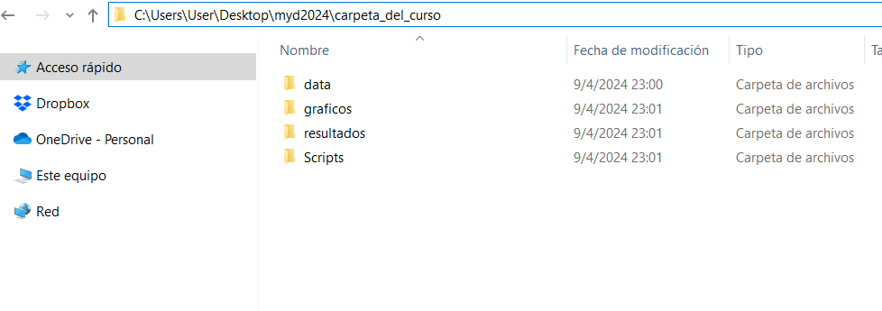

class: inverse, center, middle

```{r setup, include=FALSE, warning=FALSE}
library(xaringanthemer)
library(kableExtra)
library(xaringan)
library(tidyverse)
library(data.table)
library(xaringanExtra)

style_duo_accent(primary_color = "#0E6251",
                 secondary_color = "#507786",
                 text_font_family = "Droid Serif",
                 text_font_url = "https://fonts.googleapis.com/css?family=Droid+Serif:400,700,400italic",
                 header_font_google = google_font("Yanone Kaffeesatz"),
                 text_slide_number_color = "#000000")
knitr::opts_chunk$set(echo = FALSE)
options("kableExtra.html.bsTable" = T)

htmltools::tagList(
  xaringanExtra::use_clipboard(
    button_text = "<i class=\"fa fa-clipboard\"></i>",
    success_text = "<i class=\"fa fa-check\" style=\"color: #90BE6D\"></i>",
    error_text = "<i class=\"fa fa-times-circle\" style=\"color: #F94144\"></i>"
  ),
  rmarkdown::html_dependency_font_awesome()
)
xaringanExtra::use_xaringan_extra(c("tile_view", "animate_css", "tachyons"))
xaringanExtra::use_scribble()
use_extra_styles(
  hover_code_line = TRUE,         
  mute_unhighlighted_code = TRUE
  )  
```

class: inverse, center, middle

# Plan para hoy


---

## Introducción

- **Directorios de trabajo**

- **Proyectos**

- **Exploración data frames**

- **Estadística descriptiva**

- **Transformación de datos**

- **Creación de tablas**

- **Ejercicios**

---
class: inverse, center, middle

# Directorios de trabajo 

---

## Directorios de trabajo 
- Para abrir en R un archivo guardado en tu computadora, debes especificar en qué carpeta está guardado. Hay muchas opciones, una de ellas es fijar un directorio por defecto (es decir, especificarle a R la carpeta en la que vamos a trabajar):

.codefont[
```{r ej4, echo = TRUE, results = "hide", error=TRUE, eval = FALSE, warning=FALSE}
# Puedo fijar el directorio de trabajo con la función setwd()
# Fijar la carpeta donde vamos a importar y exportar los archivos:
setwd("micompu/micarpeta") # ojo con la / no es \
getwd() # Con está función puedo consultar el directorio
```
]

.codefont[
```{r ej5, echo = TRUE, error=TRUE, warning=FALSE}
# Ahora, si quiero leer un archivo que esté en "micompu/micarpeta" simplemente 
# escribo su nombre dentro de la función, en el lugar del "path".

# Supongamos que tengo dentro de la carpeta "micarpeta" un excel con datos
# de desempleo en Uruguay:

library(readxl)
desempleo_uru <- read_excel("data/desempleo.xlsx")
head(desempleo_uru, 4)
```
]

---

## Crear una carpeta

En la computadora en la que estés trabajando debes crear una carpeta (dentro de la carpeta que prefieras o en el escritorio), con las siguientes carpetas dentro:

- **Data** Descargar de EVA la carpeta data dentro de la sección laboratorio y pegar el contenido aquí.
- **Scripts** Descargar los distintos scripts (archivos de código) del EVA y guardarlos en esta carpeta (código de la clase, ejercicios, etc.)
- **graficos** Crear una carpeta gráficos que por el momento esté vacía, vamos a ir incluyendo guardando archivos ahí 
- **resultados** Crear una carpeta resultados que por el momento esté vacía, vamos a ir incluyendo guardando archivos ahí


---

## Carpeta del curso

Deberían ver en su carpeta algo así:

.center[
```{r ej7_b, out.width = "1000px"}

```
]

---

## Directorio de R

Al comienzo de cada script **deben** especificar el directorio donde está su carpeta del curso, de lo contrario los códigos les van a devolver errores. 

En este caso, por ejemplo, creé la carpeta "cacrpeta_del_curso" dentro de una carpeta llamada "Medicion y diseño" dentro de "cursos". Para acceder al directorio completo vayan a donde esta su carpeta hagan click derecho en la carpeta, seleccionen "propiedades" y luego ahí bajo dirección pueden copiar el directorio.

```{r ejasdasda,  echo = TRUE, eval = FALSE}
setwd("C:/Usuario/Martin/Dropbox/cursos/Medicion y diseño/cacrpeta_del_curso") 
```

De esta forma, por ejemplo, si queremos leer una base de datos llamada "datauru.xlsx" que está guardada en la carpeta data dentro de la carpeta laboratorio, simplemente tenemos que especificar la siguiente dirección (porque R ya lo va a buscar dentro de la carpeta laboratorio)

```{r ejasdasa,  echo = TRUE}
datauru <- read_excel("data/datauru.xlsx") 
```


---
class: inverse, center, middle

# Importar y exportar datos

---

## Importar datos
- Hasta ahora trabajamos principalmente con datos ingresados manualmente con las funciones `c()` y `data.frame()`

- Normalmente cuando trabajamos con datos solemos utilizar datos ya creados guardados en los formatos de otros programas (ej. Excel, Stata, SPSS) 

- Existen varios paquetes que permiten importar y exportar datos desde distintos formatos. Algunos de los más utilizados son [readr](https://readr.tidyverse.org/), [haven](https://haven.tidyverse.org/), [readxl](https://readxl.tidyverse.org/) y [utils](https://www.rdocumentation.org/packages/utils/versions/3.6.2)

- El primer paso es siempre identificar la extensión del archivo que queremos importar. Por ejemplo, las planillas excel (dependiendo de la versión) suelen tener extension .xlsx. Pueden consultar la extensión de un archivo con botón derecho + propiedades

- Luego deben identificar en qué carpeta está guardada esa base de datos.

---

## Importar datos 
Distintas funciones nos sirven para importar datos a R desde distintos formatos. Veamos algunos ejemplos:

.codefont[
```{r ej8, echo = TRUE, results="hide", message=FALSE, warning=FALSE}
# Con la función read_csv() del paquete readr importamos archivos .csv
library(tidyverse)
gapminder_csv <- read_csv("data/gapminder.csv")

# Con la función read_excel() del paquete readxl importamos archivos excel
library(readxl)
gapminder_excel <- read_excel("data/gapminder.xlsx")

```
]

.codefont[
```{r ej8_b, echo = TRUE}
# Vemos que los dataframes son iguales, tienen la mismas filas y columnas
dim(gapminder_csv)
dim(gapminder_excel)
```
]
---

## Importar datos
Algunos paquetes incluyen datos, por ejemplo, gapminder. En la documentación del paquete se encuentra el nombre de los datos. Con una simple asignación los podemos cargar 
```{r ej9, echo = TRUE, message=FALSE, warning=FALSE}
#install.packages("gampminder")
library(gapminder)

data_gapminder <- gapminder
head(data_gapminder)
```

---

## Importar datos
También es posible importar datos guardados en los formatos de otros softwares estadísticos como SPSS o Stata. Para esto usaremos el paquete haven.

.codefont[
```{r ej10, echo = TRUE}
library(haven)

# SPSS
gapminder_spss <- read_spss("data/gapminder.sav") 

# STATA
gapminder_stata <- read_stata("data/gapminder.dta") 
```
]

O podríamos llamar a la función y paquete dado que generalmente solo utilizamos una función de los paquetes que cargan datos (depende del caso obviamente)

.codefont[
```{r ej10bb, echo = TRUE}
# SPSS
gapminder_spss <- haven::read_spss("data/gapminder.sav") 

# STATA
gapminder_stata <- haven::read_stata("data/gapminder.dta") 
```
]

---

## Importar datos 
R también cuenta con sus propios formatos de almacenamiento de datos (`.rds` y `.Rdata` o `.rda`). Este enfoque es poco práctico si queremos usar los datos almacenados en otro programa, pero muy útil si solamente usaremos R dado que mantiene la información tal cual estaba en R (por ej. tipos de variables o atributos):

.codefont[
```{r ej11, echo = TRUE}
# Para esto no necesitamos cargar paquetes. 
# Guardar un objeto como .rds:
saveRDS(object = data_gapminder,
        file = "resultados/data_gapminder.rds") 

 # Leemos un archivo .rds
miobjeto_rds <- readRDS(file = "resultados/data_gapminder.rds")

# Con .rda se pueden guardar varios objetos al mismo tiempo!
# Exportamos un archivo .Rdata
save(data_gapminder, miobjeto_rds,
     file = "resultados/dos_dataframes.Rdata") 

 # Importamos un archivo .Rdata
load("resultados/dos_dataframes.Rdata")
```
]

---

## Exportar datos 
- También podemos guardar archivos desde R en otros formatos. 
- Con [readr](https://readr.tidyverse.org/) podemos exportar archivos en formato .csv 
- Con [writexl](https://cran.r-project.org/web/packages/writexl/writexl.pdf) podemos exportar directamente un excel.
- Con [haven](https://www.rdocumentation.org/packages/haven/versions/2.3.1) podemos exportar achivos en formato .dta (Stata) y .sav (SPSS)

.codefont[
```{r ej12, echo = TRUE, warning=FALSE}
# Guardar .csv
library(gapminder)
data_gapminder <- gapminder
write_excel_csv(data_gapminder, "resultados/gapminder.csv")

# Guardar excel
library(writexl)
write_xlsx(data_gapminder, "resultados/gapminder.xlsx")

# Guardar .dta (Stata)
library(haven)
write_dta(data_gapminder, "resultados/gapminder.dta")

# Guardar .sav (SPSS)
write_sav(data_gapminder, "resultados/gapminder.sav")

# Guardar .sas (SAS)
write_sas(data_gapminder, "resultados/gapminder.sas")
```
]

---
class: inverse, center, middle

# Explorar Dataframes 

---

## Resumen de un dataframe

.codefont[
```{r ej18, eval = FALSE, warning=FALSE}
# R tiene un visor para datos. Pueden dar click en el dataframe en el ambiente o:
view(data_gapminder)
```
]

.codefont[
```{r ej18b, echo = TRUE, warning=FALSE}
dim(data_gapminder) # Número de filas y columnas
names(data_gapminder) # Nombre de variables
head(data_gapminder, 3) # Imprime primeras filas (3 en este caso)
```
]

---

## Resumen de un dataframe 

Una de las funciones más utiles para resumir un dataframe es `glimpse()` del paquete dplyr o tidyverse. Es particularmente util debido a que permite un vistazo al nombre, tipo y primeros valores de .bold[todos] las variables de un dataframe.

```{r ej19bc, echo = TRUE, warning=FALSE}
# Resumen más completo:
glimpse(gapminder) 
```

---
## Tablas simples

En R Base la función para obtener frecuencias es `table()` junto con `prop.table()` y `addmargins()`

.codefontchico[
```{r ej19b_2, echo = TRUE}
# Para obtener una tabla de frecuencias de una variable usamos la función
# table() de R Base
tabla_1 <- table(data_gapminder$continent) # Frecuencia simple
tabla_1 

prop.table(tabla_1) # Proporciones

addmargins(tabla_1) # Totales

addmargins(prop.table(tabla_1)) # Proporciones y totales
```
]


---
class: inverse, center, middle

# Estadística descriptiva

---

## Medidas de tendencia central 

.codefont[
```{r ej20, echo = TRUE}
mean(data_gapminder$lifeExp) # Media
median(data_gapminder$lifeExp) # Mediana
sd(data_gapminder$lifeExp) # Desvío estandar
```
]

---

## Rangos 

```{r ej21, echo = TRUE}
range(data_gapminder$lifeExp) # Rango
max(data_gapminder$lifeExp)
min(data_gapminder$lifeExp)
```

---

## Histogramas 
También podemos graficar los datos rápidamente. Por ejemplo, un histograma:

.center[
.codefont[
```{r ej22, echo = TRUE,  out.width = '400px'}
hist(data_gapminder$lifeExp,
     main = "Distribución de expectativa de vida (Gapminder)")
```
]
]
---

## Gráfico de dispersión (scatterplot) 

.center[
```{r ej22_b, echo = TRUE,  out.width = '400px'}
plot(data_gapminder$lifeExp, data_gapminder$gdpPercap,
     main = "Relación entre expectativa de vida y PBI per cápita")
```
]


---

## Ejercicio

.content-box-blue[
*(1) Importar el archivo excel en la carpeta data llamado "datauru"*

*(2) Explorar las variables y el tipo de cada variable con la función glimpse()*

*(3) Calcular la media de una variable numérica*

*(4) Crear una tabla de proporciones con la distribución de la variable partido*

*(5) Crear un gráfico de dispersión con las variables inflación (eje de las x) y aprobación (eje de las y)*
]

---
class: inverse, center, middle

# Transformar datos

---
## Transformar datos con dplyr

El paquete dplyr contiene funciones muy útiles para la transformación de dataframes (tibbles). Todas las funciones tienen en común que su primer argumento es un dataframe y que devuelven un dataframe. Algunas de las funciones que vamos a ver:

- `filter()`: filtrar observaciones en base a valores
- `select()`: filtrar variables 
- `mutate()`: crear o recodificar variables
- `group_by()`: define grupos de valores utilizar las otras funciones
- `summarise()`: colapsa valores según alguna fórmula (sumar, número de casos, media, etc.)

---
## Filtrar
Una de las tareas más comunes en el análisis de datos es filtrar observaciones en base a condiciones. Existen muchas maneras de filtrar datos en R, la función `filter()` de dplyr es una de las más sencillas de utilizar. El primer argumento es el dataframe y el segundo la condición por la que queremos filtrar.

.codefont[
```{r chsdsdsds1, echo = TRUE}
# Tenemos datos de muchos años:
table(gapminder$year)

# Filtremos para con los datos a partir de 2007
gapminder_07 <- filter(gapminder, year == 2007)
table(gapminder_07$year)
```
]

---
## Operadores aritméticos 

```{r ejsdsd11, echo = FALSE}
tabla2 <- data.frame(Operador=c("+", "-", "*", "%", "^"),
                     Descripcion=c("Suma", "Resta", "Multiplicación", "División", "Potencia"),
                     Ejemplo=c("2+2", "2-2", "2*2", "2%2", "2^3"),
                     Resultado=c("4", "0", "4", "1", "8"))
tabla2 %>%
  kbl() %>%
  kable_styling(bootstrap_options = c("striped", "hover", "condensed"), font_size = 20)

```

---

## Operadores relacionales 

```{r ej11bsdsd, echo = FALSE}
tabla3 <- data.frame(Operador=c("<", ">", "<=", ">=", "%in%", "==", "!="),
                     Descripcion=c("Menor a", "Mayor a", "Menor o igual a", "Mayor o igual a",
                                   "Está incluido dentro de","Igual a", "Distinto a"),
                     Ejemplo=c("4 < 4", "6 > 2", "4 <= 4", "6 >= 2", "2 %in% c(0, 1, 2)","hola == hello", "hola != hello"),
                     Resultado=c("FALSE", "TRUE", "TRUE", "TRUE", "TRUE", "FALSE", "TRUE"))
tabla3 %>%
  kbl() %>%
  kable_styling(bootstrap_options = c("striped", "hover", "condensed"), font_size = 20)

```

---

## Operadores booleanos

```{r ej11cssds, echo = FALSE}
tabla4 <- data.frame(Operador=c("a & b ", "a | b", "!a", "isTrue(a)"),
                     Prueba=c("a y b son verdaderos", "al menos una de a o b son verdaderas", "a no es verdadera", "a es verdadera"))
tabla4 %>%
  kbl() %>%
  kable_styling(bootstrap_options = c("striped", "hover", "condensed"), font_size = 20)

```

---
## Filtrar

Utilizando operadores lógicos podemos filtrar de formas más complejas:

```{r ch2b, echo = TRUE}
# Todas los años menos 2007
gapminder_pre07 <- filter(gapminder, year != 2007)
table(gapminder_pre07$year)

# Solo los siguientes años: 1952, 1992 y 2007
anios_especificos <- c(1952, 1992, 2007)
gapminder_esp <- filter(gapminder, year %in% anios_especificos)

table(gapminder_esp$year)
```

---
## Seleccionar variables
Con `select()` podemos seleccionar las variables (columnas) que queremos mantener en un dataframe. Podemos nombrarlas, seleccionar cuáles queremos eliminar y referirnos por su orden:

```{r ch4, results = "hide", echo = TRUE}
# Selccionar un conjunto de variables (país, año, población)
select(gapminder, country, year, pop)

# Selccionar todas las variables menos las especificadas
select(gapminder, -continent)

# Seleccionar un rango de variables según orden
select(gapminder, country:lifeExp)
select(gapminder, 1:3) # Orden numérico
```

---

## Pipeline %>% 

Cuando queremos realizar más de una operación a un dataframe podemos utilizar el pipeline. Como vimos, la mayoría de las funciones de dplyr que se aplican a un dataframe tienen como primer argumento el dataframe al que le queremos aplicar la función. 

Con el pipeline especificamos el dataframe solamente una vez al principio, y luego todas las funciones que vamos utilizando no necesitan especificación. De esta forma nos enfocamos en la transformación y no en el objeto.

.codefont[
```{r ch6, echo = TRUE}
gapminder_07_america <- gapminder %>% 
  filter(year == 2007 & continent == "Americas") %>% 
  select(-continent)

print(gapminder_07_america)
```
]

---
## Pipeline %>% 
- Una de las ventajas del Tidyverse es la facilidad con la que se puede leer e interpretar el código. Un elemento fundamental para esto es el pipeline (`%>%`). Es muy útil para expresar una secuencia de muchas operaciones.

- Habíamos visto varias formas de realizar esto: sobrescribir el mismo objeto, con objetos intermedios o anidando funciones. 

- El pipeline del paquete [magrittr](https://magrittr.tidyverse.org/) hace más fácil modificar operaciones puntuales dentro de conjunto de operaciones, hace que sea más fácil leer (evitando leer de adentro hacia afuera) entre otras ventajas.

- Es recomendable evitar usar el pipeline cuando queremos trabajar más de un objeto a la vez

- `x %>% f == f(x)`

- Se puede leer como un "y entonces"

---
## Otras funciones de dplyr muy útiles

- `arrange()` ordenar los datos según una o más variables

- `rename()` cambiar el nombre de las variables de un dataframe

- `pull()` y `distinct()`: con `distinct()` es posible identificar los valores distintos de una variable y con `pull()` los podemos extraer como un vector

- `slice_min()` y `slice_max()`: filtrar n observaciones de mayor o menor valor según variable. En general, la familia de funciones [slice](https://dplyr.tidyverse.org/reference/slice.html) permite filtrar observaciones en función de su posición.  

- `count()` contar observaciones por grupo

- `relocate()` cambiar el orden de columnas

---

class: inverse, center, middle

# Crear y recodificar variables 

---

## Crear variables con mutate() 
El paquete [dplyr](https://cran.r-project.org/web/packages/dplyr/dplyr.pdf) contiene la función [`mutate()`](https://www.rdocumentation.org/packages/dplyr/versions/0.5.0/topics/mutate) para crear nuevas variables. `mutate()` crea variables al final del dataframe.

.codefont[
```{r ej25, echo = TRUE}
data_gapminder <- gapminder

# Variable de caracteres
data_gapminder <- mutate(data_gapminder, var1 = "Valor fijo") 

# Variable numérica
data_gapminder <- mutate(data_gapminder, var2 = 7) 
head(data_gapminder, 3)

## Podemos escribir lo mismo de distinta manera:
data_gapminder <- mutate(data_gapminder, var1 = "Valor fijo",
                                         var2 = 7)
```
]

---

## Recodificar variables con mutate() 
.codefont[
Con `mutate()` también podemos realizar operaciones sobre variables ya existentes:
```{r ej26, echo = TRUE}
## Podemos recodificar usando variables y operadores aritméticos
# Calculemos el pbi total (pbi per capita * población)
d_gap <- mutate(gapminder, gdp = gdpPercap * pop)
head(d_gap, 3)
# Podemos calcular el logaritmo 
d_gap <- mutate(d_gap, gdp_log = log(gdp))
head(d_gap, 2)
```
]

---

## Transformaciones de tipo 

Al igual que hacíamos con los vectores, podemos tranformar el tipo de una variable 

```{r ej2bcsb, echo = FALSE}
d_gap <- select(gapminder, continent, year, lifeExp)
```

.codefont[
```{r ej28bb, echo = TRUE}
# Exploro tipo de variables
glimpse(d_gap)

# Variable continente a caracteres y año a factor
d_gap <- d_gap %>% 
  mutate(continent = as.character(continent),
         year = as.factor(year))

glimpse(d_gap)
```
]


---
class: inverse, center, middle

# Recodificaciones condicionales

---

## Recodificaciones condicionales
- Muchas veces transformar los datos implica recodificar una variable de forma condicional, esto es, asignar distintos valores en función de los valores de una o más variables.

- Para esto podemos utilizar las funciones; [ifelse()](https://www.rdocumentation.org/packages/base/versions/3.6.2/topics/ifelse) (R Base), [mutate()](https://www.rdocumentation.org/packages/dplyr/versions/0.5.0/topics/mutate), [recode()](https://www.rdocumentation.org/packages/dplyr/versions/0.7.8/topics/recode) y [case_when()](https://dplyr.tidyverse.org/reference/case_when.html) (Tidyverse)

- Nosotros veremos recodificaciones condicionales con `case_when()` y `mutate()`

---

## Recodificación condicional con case_when y mutate

Podemos crear variables condicionales con `case_when()` del paquete  dplyr. Esencialmente, con `ifelse()` (R Base) podemos lograr lo mismo que con `case_when()` (Tidyverse). `case_when()` puede resultar más sencilla de utilizar al no haber necesidad de anidar la función cuando establecemos múltiples condiciones. 

Cuando trabajmos con dataframes `case_when()` se utiliza dentro de `mutate()`. `case_when()` testea condiciones en orden (esto es importante cuando pasamos condiciones no excluyentes). `case_when()` lista condiciones para las que asigna un valor en caso de que sean verdaderas, y permite pasar múltiples condiciones. `TRUE` refiere a las condiciones no listadas. La estructura de `case_when()` es: 


```{r ej28m, eval = FALSE,  echo = TRUE}
data %>% 
  mutate(var_nueva = case_when(var_original == "Valor 1" ~ "Valor A",
                               var_original == "Valor 2" ~ "Valor B",
                               TRUE ~ "Otros"))
```


---
## Recodificación condicional con case_when y mutate


```{r ej28c_2, echo = TRUE}
d_gap <- gapminder

# Creemos una variable que indique si el país es Uruguay o no
d_gap <- d_gap %>% 
  mutate(uruono = case_when(
    country == "Uruguay" ~ "Si",
    TRUE ~ "No")
    )

table(d_gap$uruono)
```


---
## Recodificación condicional con case_when y mutate

Podemos establecer varias condiciones fácilmente:

.codefont[
```{r ej28n2, echo = TRUE}
d_gap <- gapminder

d_gap <- d_gap %>% 
  mutate(mercosur = case_when(country == "Uruguay" ~ 1,
                              country == "Argentina" ~ 1,
                              country == "Paraguay" ~ 1,
                              country == "Brazil" ~ 1, 
                              TRUE ~ 0))

table(d_gap$mercosur)
```
]


---
## Recodificación condicional con case_when y mutate

También podríamos usar operadores para simplificar esto:

.codefont[
```{r ej28f3, echo = TRUE}
d_gap <- d_gap %>% 
  mutate(mercosur = case_when(
  country %in% c("Argentina", "Paraguay", "Brazil", "Uruguay") ~ 1,
  TRUE ~ 0)
  ) 

d_gap <- d_gap %>% 
  mutate(mercosur2 = case_when(
    country == "Argentina" | country == "Paraguay" |
      country == "Brazil" | country == "Uruguay" ~ 1,
    TRUE ~ 0)
    )

identical(d_gap$mercosur, d_gap$mercosur2)
```
]


---
## Recodificación condicional con case_when y mutate

Recodificación con valores numéricos. Supongamos que queremos crear una nueva variable pob_rec, que clasifica a los países en población grande (más de 20 millones), mediana (entre 5 y 20) o pequeña (menos de 5)

.codefont[
```{r ej28f3sdas, echo = TRUE}
d_gap <- d_gap %>% 
  mutate(pob_rec = case_when(
    pop >= 20000000 ~ "Grande",
    pop >= 5000000 & pop < 20000000 ~ "Mediana",
    pop < 5000000 ~ "Pequeña",
    TRUE ~ "Error")
  ) 

table(d_gap$pob_rec)
```
]


---

## Recodificación condicional con case_when y mutate

`case_when()` sirve también para recodificar una variable con condiciones basadas en múltiples variables.

Supongamos que queremos una variable que indique los países-año con expectativa de vida mayor a 75 o pbi per cápita mayor a 20.000

.codefont[
```{r ej28o, echo = TRUE}
d_gap <- d_gap %>% 
  mutate(var1 = case_when(gdpPercap > 20000 ~ 1,
                          lifeExp > 75 ~ 1,
                          TRUE ~ 0))
table(d_gap$var1)
```
]

---

## Ejercicio

.content-box-blue[
*(1) Abran un script nuevo y tomen el dataframe de gapminder (importarlo de la carpeta data o descargarlo desde el paquete gapminder como debajo, y filtrar para la base para quedarnos solamente con las observaciones América y Oceania*

```{r ej28o___2, echo = TRUE}
library(gapminder)
gapminder <- gapminder
```

*(2) En ese mismo dataframe con solamente las observaciones de América y Oceanía seleccionar solamente tres variables: country y lifeExp*

*(3) En ese mismo dataframe, crear una nueva variable que divida la expectativa de vida en 3 categorías: "Alta" (mayor o igual a 75 años); "Media" (mayor o igual a 65 y menor a 75 y "Baja" (menor a 65 años)*

*(4) Asegurarse de hacer los primeros 3 pasos en un mismo pipeline*
]

---
class: inverse, center, middle

# Tablas cruzadas

---
## Resumir datos: tablas simples

Con `count()` podemos hacer lo mismo que con `table()`, pero en el contexto del tidyverse. Con un simple `mutate()` podemos transformar la frecuencia simple en proporción o porcentaje

.codefontchico[
```{r ch9sdasss, echo = TRUE}
# Frecuencia simple
d_gap %>% 
  count(continent)

# Frecuencia proporción
d_gap %>% 
  count(continent) %>% 
  mutate(per = n/sum(n)*100) %>% # Porcentaje
  mutate(prop = n/sum(n)) # Proporción
```
]

---
## Resumir datos: tablas cruzadas

Cuando usamos `count()` con dos variables vemos que la salida está en formato largo. Eso nos puede servir para graficar si usamos ggplot2 y para otros paquetes, pero no es como generalmente queremos leer una tabla para interpretarla. 

.codefontchico[
```{r ch9ssdsdsdas, echo = TRUE}
# Tabla cruzada en formato largo
d_gap %>% 
  count(continent, pob_rec)

```
]

---
## Resumir datos: tablas cruzadas

 Para pasar a formato ancho podemos utilizar la función `spread()`. El primer argumento dentro de `spread()` es la variable que queremos que pase a ser columnas y el segundo argumento la variable que contiene los valores.

.codefont[
```{r ch9ssssdsdsdas, echo = TRUE}
# Tabla cruzada en formato ancho
d_gap %>% 
  count(continent, pob_rec) %>% 
  spread(pob_rec, n)
```
]

---
## Resumir datos: tablas cruzadas

Cuando analizamos tablas cruzadas, muchas veces queremos ver procentajes en lugar de frecuencias. Para ello podemos transformar la frecuencia en porcentaje.

.codefont[
```{r ch9sdas2222, echo = TRUE}
# Porcentaje total
d_gap %>% 
  count(continent, pob_rec) %>%
  mutate(n = n/sum(n)*100) %>% 
  spread(pob_rec, n)
```
]

---
## Resumir datos: tablas cruzada

Cuando trabajamos con procentajes en tablas cruzadas, tenemos que considerar el total del %. En el ejemplo anterior el porcentaje era sobre el total, muchas veces queremos calcularlo sobre cada fila o cada columna

.codefontchico[
```{r ch9sdas1111, echo = TRUE}
# % de paises en cada tamaño de población por continente 
d_gap %>% 
  count(continent, pob_rec) %>%
  mutate(n = n/sum(n)*100, .by = continent) %>% 
  spread(pob_rec, n)

# % de continente por tamaño de población  
d_gap %>% 
  count(continent, pob_rec) %>%
  mutate(n = n/sum(n)*100, .by = pob_rec) %>% 
  spread(pob_rec, n)
```
]


---
class: inverse, center, middle

# Tablas con estadísticas descriptivas

---
## Resumir datos 

Resumir datos con estadísticos descriptivos es una de las partes fundamentales del análisis de datos. Para ello utilizaremos la función `summarise()` o `summarize()`, muchas veces en conjunto con `group_by()`. 

Escencialmente `summarise()` resume un dataframe en una fila según una estadística especificada. Por ejemplo, calculando la media de una variable

.codefont[
```{r ch9, echo = TRUE}
gapminder %>% 
  summarise(media = mean(lifeExp, na.rm=T))

# Por ahora no hay mucha diferencia con
mean(gapminder$lifeExp, na.rm = TRUE)
```
]


---
## Resumir datos 

Hasta ahora `summarise()` no nos es de gran utilidad, la utilidad de `summarise()`  es su uso conjunto con `group_by()`, para estimar diferentes estadísticas según grupos específicos. 

Cuando utilizamos `group_by()` en un pipeline cambiamos la unidad de análisis desde todo el dataframe a niveles de una variable. Retomando el ejemplo, podemos ver el promedio de expectativa de vida según año:

.codefont[
```{r ch10, echo = TRUE}
gapminder %>% 
  group_by(year) %>% 
  summarise(media = mean(lifeExp, na.rm = T)) 

```
]


---
## Resumir datos 

Algunas de las operaciones más utilizadas para resumir datos:

- `mean()`: media 
- `median()`: mediana
- `sd()`: desvío estandar
- `sum()`: suma
- `n()`: número de observaciones
- `n_distinct()`: número de valores únicos
- `min()` y `max()`: mínimo y máximo
- `first()`: primer valor


---
## Resumir datos

Podemos utilizar más de una variable dentro de `group_by()`. Por ejemplo, calculemos la media de expectativa de vida por año comparando America y Europa para 1997, 2002 y 2007:

.codefont[
```{r ch12, echo = TRUE, warning=FALSE}
resumen_1 <- gapminder %>% 
  filter(continent %in% c("Americas", "Europe")) %>% 
  filter(year >= 1997) %>% 
  group_by(continent, year) %>% 
  summarise(media = mean(lifeExp, na.rm = TRUE)) 
resumen_1
```
]

---
## Resumir datos

Una de las grandes ventajas de `summarise()` es que podemos resumir muy fácilmente varias estadísticas en un solo dataframe. 

.codefont[
```{r ch13, echo = TRUE}
resumen_2 <- gapminder %>% 
  filter(continent %in% c("Americas", "Europe")) %>%
  filter(year == 2007) %>%
  group_by(continent) %>% 
  summarise(media = mean(gdpPercap),
            desvio = sd(gdpPercap),
            suma = sum(gdpPercap),
            max = max(gdpPercap),
            min = min(gdpPercap),
            paises = n()) 

resumen_2
```
]

---
## Exportar tablas

Las tablas y resumenes de salida de tidyverse son dataframes. Como tales, los podemos exportar fácilmente a otros tipos de archivos. Veamos como exportar una tabla con la funcion `write_xlsx()` del paquete `writexl`. Ya habíamos creado la tabla "resumen_2", entonces con una sola línea de código la podemos guardar. La función `write_xlsx()` tiene dos argumentos principales, el dataframe a ser guardado y el directorio donde ser guardado junto con el nombre del archivo que vamos a crear. Tener en cuenta que si el directorio y nombre de un archivo coincide con el de otro archivo ya existente en la computadora, lo sobreeescribirá.

.codefont[
```{r ch13___8, echo = TRUE}
library(writexl)
writexl::write_xlsx(resumen_2, "resultados/mi_primera_tabla.xlsx")
```
]


---

## Ejercicio

.content-box-blue[
*Para este ejercicio vamos a utilizar el dataframe de gapminder y vamos a crear una variable nueva recodificando los valores la variable de pbi per capita (gdpPercap). Para eso peguen el código debajo*

```{r ch9sdas11321, echo = TRUE}
library(gapminder)
gapminder <- gapminder %>% 
  mutate(gdp_rec = case_when(
    gdpPercap < 2000 ~ "Bajo",
    gdpPercap >= 2000 & gdpPercap <= 5000 ~ "Medio",
    gdpPercap > 5000 ~ "Alto"
  ))
```

*(1) Utilizar count() para crear una tabla con el % de casos en cada categoría de la recodificación de pbi per cápita*

*(2) Ahora crear una tabla cruzada entre continente y la variable recodificada de pbi per cápita (incluir el % a nivel de fila)*

*(3) Crear una tabla resumen con la media de la expectativa de vida y la cantidad de casos según continente *

]


