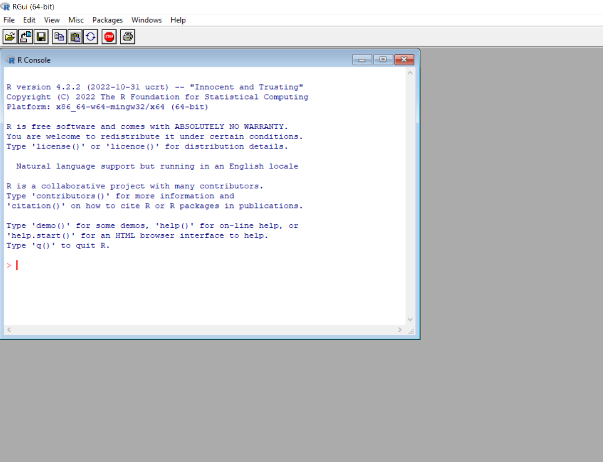

```{r setup, include=FALSE, message=FALSE}
knitr::opts_chunk$set(echo = TRUE)
library(dplyr)
```

```{css, echo=FALSE}
h1, h3, h4 {
  text-align: center;
}

body {
  font-size: 12pt;
}
```

## ¿Qué es R y R Studio?

R es un software y un lenguaje de programación libre y gratuito enfocado en el análisis estadístico y la visualización de datos. R cuenta con gran potencia y flexibilidad, así como una númerosa -y creciente- comunidad de usuarios tanto académicos como profesionales.

R Studio es un entorno de desarrollo integrado (IDE) . O en otras palabras, es una interfaz un poco (bastante) más amigable que usar R directamente.

Para comenzar a utilizar R es necesario descargar el software en tu computadora, y el curso será mostrará como programar desde R Studio por lo que es necesario instalarlo también. Tanto R como R Studio son gratuitos y su descarga es muy sencilla.


## Instalar R

Para instalar R deben entrar a la página de [CRAN](https://cran.r-project.org/) y clickear en los enlaces de arriba donde dice "Download R for (...)" y seleccionar el sistema operativo de tu computadora (Windows, OS o Linux). Luego dar click a "install R for the first time" y luego clickear la versión de R que figura en el primer enlace. Luego seguir los pasos de la instalación. 

Una vez que esté instalado R puedes abrir el programa y se verá de la siguiente manera:

{width=80%}

## Instalar R Studio

Sin embargo, nosotros vamos a utilizar R desde R Studio. Para ello debemos instalar R Studio, debemos entrar al sitio web de [R Studio](https://posit.co/) (ahora llamado Posit). Una vez que deben buscar donde dice "download R Studio" y seguir las instrucciones.  R Studio se ve de la siguiente manera:

{width=80%}


Ahora cada vez que queramos usar R podemos clickear en el icono de R Studio y ya podemos empezar a programar!

## Paquetes

Los paquetes de R son conjuntos de funciones (comandos), documentación y a veces datos, que generalmente están relacionados y se encuentran en un mismo ambiente. Para muchos de los usos de R necesitamos instalar paquetes porque las funciones que vienen por defecto en R no agotan todo lo que es posible hacer con este lenguaje. 

El repositorio principal donde se alojan los paquetes de R se llama Comprehensive R Archive Network CRAN. Hay más de 10.000 paquetes alojados en [CRAN](https://cran.r-project.org/). Aquí hay dos listas con algunos de los paquetes más útiles: [support.rstudio](https://support.posit.co/hc/en-us/articles/201057987-Quick-list-of-useful-R-packages) y [towardsdatascience](https://towardsdatascience.com/a-comprehensive-list-of-handy-r-packages-e85dad294b3d).

Los paquetes normalmente están relacionados a alguna temática, por ejemplo existen paquetes específicos para manipulación de datos [dplyr](https://cran.r-project.org/web/packages/dplyr/dplyr.pdf), visualización de datos [ggplot2](https://cran.r-project.org/web/packages/ggplot2/ggplot2.pdf) o importar y exportar datos [readr](https://cran.r-project.org/web/packages/readr/readr.pdf). Dado que R es libre, cualquier persona puede crear y publicar un paquete (publicarlo en CRAN requiere ciertos procesos igualmente), esto facilita que haya paquetes muy específicos para ciertas tareas que pueden ser de gran utilidad. Por ejemplo, existen paquetes para  conectarse con la API de Twitter [rtweet](https://cran.r-project.org/web/packages/rtweet/rtweet.pdf), para utilizar los datos de [Gapminder](https://cran.csiro.au/web/packages/gapminder/gapminder.pdf) o para analizar datos electorales y de opinión pública en Uruguay [opuy](https://github.com/Nicolas-Schmidt/opuy/blob/master/man/figures/Manual_opuy.pdf)

Cuando abrimos R solamente tenemos cargado por defecto el paquete Base. La primera vez que queremos utilizar un paquete tenemos que descargarlo con el siguiente comando:

```{r eval = FALSE}
# Para descargar paquetes de CRAN, utilizamos la siguiente función:
install.packages("dplyr") 
```

Existen otros paquetes no alojados en CRAN, que se instalan con el paquete `devtools`

Luego de instalarlo (una sola vez por versión de R), tenemos que cargar el paquete utilizando la función `library()`

```{r eval = FALSE}
library(dplyr)
```

Una vez instalado el paquete podemos utilizar las funciones que vienen con el. Por ejemplo, seleccionar las variables de un dataframe o marco de datos

```{r }
# Creamos un dataframe o marco de datos
df <- data.frame(color_preferido = c("azul", "rojo", "verde"),
                 edad = c(30, 50, 40),
                 altura = c(180, 165, 170))

df

# Usamos la función select() del paquete dplyr para quedarnos solamente con
# las variables color_preferido y edad
df <- select(df, color_preferido, edad)

df
```


## Versiones

R se actualiza constantemente, y lógicamente no todas las versiones son iguales. Esto puede traer algunos problemas, por ejemplo, algunos paquetes no están disponibles para versiones anteriores o posteriores a la versión en la que fueron creados. En el mensaje de bienvenida, (lo que aparece en la consola cuando abrimos una sesión de R a través de R Studio) aparece la versión del programa que tenemos instalada. Si queremos actualizar R, lo podemos hacer desde R con el paquete `installr`.

```{r, eval=FALSE}
install.packages("installr", dependencies = TRUE) # Instalar paquete
library(installr) # Cargar paquete
updateR() # Correr función 
```


&nbsp;
<hr />

<div style="text-align: center">										


<center>
{width=30%}
</center>
<br>

 <font size="4"> Facultad de Ciencias Sociales - UdelaR </font> 

<br>
