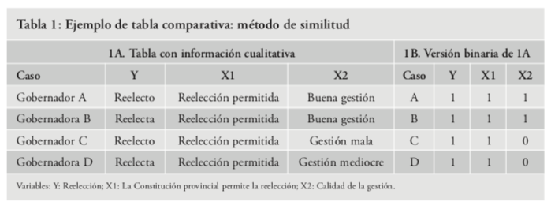
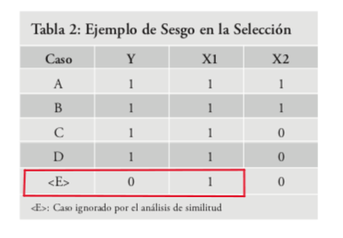
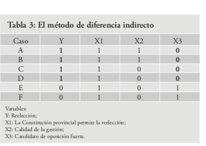
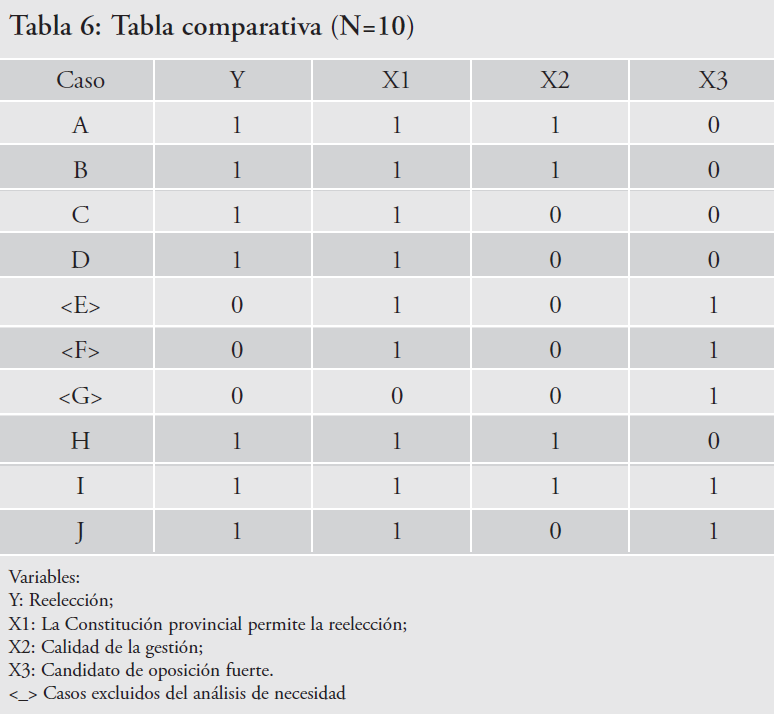
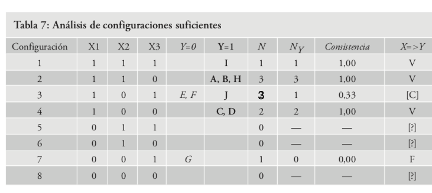
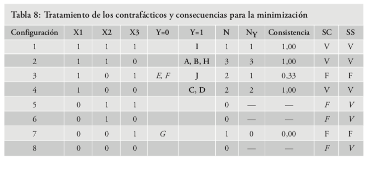

class: inverse, center, middle

```{r setup, include=FALSE, warning=FALSE}
library(xaringanthemer)
library(kableExtra)
library(xaringan)
library(xaringanExtra)
library(rio)
library(tidyverse)
library(forcats)

style_duo_accent(primary_color = "#0E6251",
                 secondary_color = "#507786",
                 text_font_family = "Droid Serif",
                 text_font_url = "https://fonts.googleapis.com/css?family=Droid+Serif:400,700,400italic",
                 header_font_google = google_font("Yanone Kaffeesatz"),
                 text_slide_number_color = "#000000")
knitr::opts_chunk$set(echo = FALSE)
options("kableExtra.html.bsTable" = T)

htmltools::tagList(
  xaringanExtra::use_clipboard(
    button_text = "<i class=\"fa fa-clipboard\"></i>",
    success_text = "<i class=\"fa fa-check\" style=\"color: #90BE6D\"></i>",
    error_text = "<i class=\"fa fa-times-circle\" style=\"color: #F94144\"></i>"
  ),
  rmarkdown::html_dependency_font_awesome()
)
use_xaringan_extra(c("tile_view", "animate_css", "tachyons"))
use_scribble()
use_extra_styles(
  hover_code_line = TRUE,         
  mute_unhighlighted_code = TRUE
  )  

```

# Plan para hoy

---

## Plan para hoy

<br/>
<br/>


**1. Discusión del texto de Albala **


**2. Ejemplos del texto de Pérez-Liñan (2010) en R**


**3. Ejercicios en R con paquetes SetMethods y QCA**

<br/>
<br/>

Consejo: Cree un proyecto y descargue dentro el contenido de la **carpeta de eva Laboratorio metodo comparado**

El código de la presentación (livecoding) está en el script **codigo_5.R**

Las bases de datos que utilizaremos son: **ej_pl.xlsx** y **data_ej_comparado.xlsx** (ojo que tienen varias hojas, usar el argumento `which()` de **rio::import** para seleccionar la que corresponda)

---

class: inverse, center, middle

# 1. Discusión del texto de Albala

---

## Discusión del texto de Albala

Albala, A. (2016). Presidencialismo y coaliciones de gobierno en América Latina: Un análisis del papel de las instituciones. Revista de ciencia política (Santiago), 36(2), 459-479.

---

## Preguntas al texto de Albala

1. ¿Cuál es el objetivo del trabajo?

2. ¿Cómo selecciona los casos?

3. ¿Cuál es su universo poblacional?

4. ¿Cuál es su muestra?

5. ¿Identifica algún problema de sesgo de selección?

6. ¿Cuál es la variable dependiente?

7. ¿Cuáles son la variables independientes?

8. ¿Cuáles son los resultados?

---

class: inverse, center, middle

# 2. Ejemplos del texto de Pérez-Liñan (2010) en R 

---

## Paquetes necesarios

- [**SetMethods**](https://cran.r-project.org/web/packages/SetMethods/index.html)

- [**QCA**](https://cran.r-project.org/web/packages/QCA/index.html)

- **tidyverse** y **rio**

<br/>

Instalaciones necesarias:

.codefont[
```{r pack, echo = TRUE, eval=FALSE, message=FALSE, warning=FALSE, include = TRUE }

install.packages("SetMethods")
install.packages("QCA")
```
]

<br/>
<br/>

El livecoding de esta clase está en el script `clase_5.R` disponible en eva Laboratorio Método comparado

---

## ¿Qué vamos a hacer?

Reproducir en R los ejemplos que plantea Pérez-Liñan (2010):

<br/>

1. Método de la similitud (Tabla 1)

2. Problemas de la tabla de similitud (Tabla 2)

3. Método de la diferencia indirecta (Tabla 3)

4. Análisis configuracional (Tabla 6)

5. Minimización lógica


---

## 1. Método de la similitud (Tabla 1)


.center[
```{r, out.width = "1000px"}

```
]

---

## 1. Método de la similitud (Tabla 1)

.codefontmaschico[
```{r t1, echo = TRUE, eval=FALSE, message=FALSE, warning=FALSE, include = TRUE, out.width="500px", out.height="500px" }
library(rio)
library(tidyverse)
library(SetMethods)
library(QCA)

# importo la base
data_1 <- rio::import("ej_pl.xlsx", which = 1)

# pongo la variable caso como nombre de filas, para que no la cuente como variable
data_1 <- data_1 %>% 
  remove_rownames %>% 
  column_to_rownames(var="caso") 

# hago un análisis de necesidad con la función QCAfit del paquete SetMethods
# LLamar a la función, data, variable dependiente (Y), necessity = TRUE
QCAfit(data_1, data_1$Y, necessity = TRUE)

# Si quiero guardar el resultado en un data frame, me quedo sólo con la columna 1
analisis_nec_1 <- as.data.frame(QCAfit(data_1, data_1$Y, necessity = TRUE)) %>% 
  select(Cons.Nec) %>% # selecciono la columna del análisis de necesidad
  filter(Cons.Nec == 1) %>% # filtro las cons. Nec. consistentes = 1 "Verdaderas"
  filter(row.names(.) != "Y") # elimino de la tabla la variable Y (dep)

print(analisis_nec_1) 

# preparo data para análisis de suficiencia
data_analisis_suf_1 <- data_1 %>% 
  filter(X1 == 1) %>% # selecciono las filas con X1 = 1 (presunta variable necesaria)
  filter(Y == 0) %>% # selecciono las filas con Y = 0 (para identificar casos de ausencia de Y, con presencia de X1)
  select(Y, X1)  # selecciono únicamente las variables Y y X1

# testeo una condición con ifelse para saber si hay casos que tengan Y = 0 y X1 = 1
analisis_suf_1 <- ifelse(nrow(data_analisis_suf_1) > 0, print("No suficiente"), print("Suficiente"))
```
]

--

- Estructura de `ifelse()`: 

.codefontchico[
```{r ifelse, echo = TRUE, eval=FALSE, message=FALSE, warning=FALSE, include = TRUE, out.width="500px", out.height="500px" }
ifelse(condicion, operación_si_TRUE, operación_si_FALSE)
```
]

---

## 1. Método de la similitud (Tabla 1)

.codefontchico[
```{r t1a, echo = TRUE, message=FALSE, warning=FALSE, include = TRUE }
library(rio)
library(tidyverse)
library(SetMethods)
library(QCA)

# importo la base
data_1 <- rio::import("ej_pl.xlsx", which = 1)

data_1

# pongo la variable caso como nombre de filas, para que no la cuente como variable
data_1 <- data_1 %>% 
  remove_rownames %>% 
  column_to_rownames(var="caso") 

data_1
```
]


---

## 1. Método de la similitud (Tabla 1)

.codefontchico[
```{r t1b, echo = TRUE, message=FALSE, warning=FALSE, include = TRUE }
# hago un análisis de necesidad con la función QCAfit del paquete SetMethods
# LLamar a la función, data, variable dependiente (Y), necessity = TRUE
QCAfit(data_1, data_1$Y, necessity = TRUE)

# Si quiero guardar el resultado en un data frame, me quedo sólo con la columna 1
analisis_nec_1 <- as.data.frame(QCAfit(data_1, data_1$Y, necessity = TRUE)) %>% 
  select(Cons.Nec) %>% # selecciono la columna del análisis de necesidad
  filter(Cons.Nec == 1) %>% # filtro las cons. Nec. consistentes = 1 "Verdaderas"
  filter(row.names(.) != "Y") # elimino de la tabla la variable Y (dep)

print(analisis_nec_1) 
```
]


---

## 1. Método de la similitud (Tabla 1)

.codefontchico[
```{r t1c, echo = TRUE, message=FALSE, warning=FALSE, include = TRUE }

# preparo data para análisis de suficiencia
data_analisis_suf_1 <- data_1 %>% 
  filter(X1 == 1) %>% # selecciono las filas con X1 = 1 (presunta variable necesaria)
  filter(Y == 0) %>% # selecciono las filas con Y = 0 (para identificar casos de ausencia de Y, con presencia de X1)
  select(Y, X1)  # selecciono únicamente las variables Y y X1

# testeo una condición con ifelse para saber si hay casos que tengan Y = 0 y X1 = 1
analisis_suf_1 <- ifelse(nrow(data_analisis_suf_1) > 0, print("No suficiente"), print("Suficiente"))
```
]

<br/>
<br/>

--

**¿Cuál es el problema?**


---

## 2. Problema Método de la similitud (Tabla 2)

.center[
```{r, out.width = "550px", out.height= "400px"}

```
]

---

## 2. Problema Método de la similitud (Tabla 2)

.codefontmaschico[
```{r t2, echo = TRUE, eval=FALSE, message=FALSE, warning=FALSE, include = TRUE }
# importo la base
data_2 <- rio::import("ej_pl.xlsx", which = 2)

# pongo la variable caso como nombre de filas, para que no la cuente como variable
data_2 <- data_2 %>% 
  remove_rownames %>% 
  column_to_rownames(var="caso") 

# hago un análisis de necesidad con la función QCAfit del paquete SetMethods
# Pasos:
# LLamar a la función, data, variable dependiente (Y), necessity = TRUE
QCAfit(data_2, data_2$Y, necessity = TRUE)

# Si quiero guardar el resultado en un data frame, me quedo sólo con la columna 1
analisis_nec_2 <- as.data.frame(QCAfit(data_2, data_2$Y, necessity = TRUE)) %>% 
  select(Cons.Nec) %>% # selecciono la columna del análisis de necesidad
  filter(Cons.Nec == 1) %>% # filtro las cons. Nec. consistentes = 1 "Verdaderas"
  filter(row.names(.) != "Y") # elimino de la tabla la variable Y (dep)

print(analisis_nec_2) 

# preparo data para análisis de suficiencia
data_analisis_suf_2 <- data_2 %>% 
  filter(X1 == 1) %>% # selecciono las filas con X1 = 1 (presunta variable necesaria)
  filter(Y == 0) %>% # selecciono las filas con Y = 0 (para identificar casos de ausencia de Y, con presencia de X1)
  select(Y, X1)  # selecciono únicamente las variables Y y X3

# testeo una condición con ifelse para saber si hay casos que tengan Y = 0 y X1 = 1
analisis_suf_2 <- ifelse(nrow(data_analisis_suf_2) > 0, print("No suficiente"), print("Suficiente"))

```
]

---

## 2. Problema Método de la similitud (Tabla 2)

.codefontchico[
```{r t2a, echo = TRUE, message=FALSE, warning=FALSE, include = TRUE }
# importo la base
data_2 <- rio::import("ej_pl.xlsx", which = 2)

data_2

# pongo la variable caso como nombre de filas, para que no la cuente como variable
data_2 <- data_2 %>% 
  remove_rownames %>% 
  column_to_rownames(var="caso") 

data_2
```
]

---

## 2. Problema Método de la similitud (Tabla 2)

.codefontchico[
```{r t2b, echo = TRUE, message=FALSE, warning=FALSE, include = TRUE }
# hago un análisis de necesidad con la función QCAfit del paquete SetMethods
# Pasos:
# LLamar a la función, data, variable dependiente (Y), necessity = TRUE
QCAfit(data_2, data_2$Y, necessity = TRUE)

# Si quiero guardar el resultado en un data frame, me quedo sólo con la columna 1
analisis_nec_2 <- as.data.frame(QCAfit(data_2, data_2$Y, necessity = TRUE)) %>% 
  select(Cons.Nec) %>% # selecciono la columna del análisis de necesidad
  filter(Cons.Nec == 1) %>% # filtro las cons. Nec. consistentes = 1 "Verdaderas"
  filter(row.names(.) != "Y") # elimino de la tabla la variable Y (dep)

print(analisis_nec_2) 
```
]

---

## 2. Problema Método de la similitud (Tabla 2)

.codefontchico[
```{r t2c, echo = TRUE, message=FALSE, warning=FALSE, include = TRUE }
# importo la base
# preparo data para análisis de suficiencia
data_analisis_suf_2 <- data_2 %>% 
  filter(X1 == 1) %>% # selecciono las filas con X1 = 1 (presunta variable necesaria)
  filter(Y == 0) %>% # selecciono las filas con Y = 0 (para identificar casos de ausencia de Y, con presencia de X1)
  select(Y, X1)  # selecciono únicamente las variables Y y X3

# testeo una condición con ifelse para saber si hay casos que tengan Y = 0 y X1 = 1
analisis_suf_2 <- ifelse(nrow(data_analisis_suf_2) > 0, print("No suficiente"), print("Suficiente"))

```
]


---

## 3. Método de la diferencia indirecta (Tabla 3)

.center[
```{r}

```
]


---

## 3. Método de la diferencia indirecta (Tabla 3)

.codefontmaschico[
```{r t3, echo = TRUE, eval=FALSE, message=FALSE, warning=FALSE, include = TRUE }
# importo la base
data_3 <- rio::import("ej_pl.xlsx", which = 3)

# pongo la variable caso como nombre de filas, para que no la cuente como variable
data_3 <- data_3 %>% 
  remove_rownames %>% 
  column_to_rownames(var="caso") 

# hago un análisis de necesidad con la función QCAfit del paquete SetMethods
# Pasos:
# LLamar a la función, data, variable dependiente (Y), necessity = TRUE
QCAfit(data_3, data_3$Y, necessity = TRUE)

# Si quiero guardar el resultado en un data frame, me quedo sólo con la columna 1
analisis_nec_3 <- as.data.frame(QCAfit(data_3, data_3$Y, necessity = TRUE)) %>% 
  select(Cons.Nec) %>% # selecciono la columna del análisis de necesidad
  filter(Cons.Nec == 1) %>% # filtro las cons. Nec. consistentes = 1 "Verdaderas"
  filter(row.names(.) != "Y") # elimino de la tabla la variable Y (dep)

print(analisis_nec_3) 

# preparo data para análisis de suficiencia X1
data_analisis_suf_3 <- data_3 %>% 
  filter(X1 == 1) %>% # selecciono las filas con X1 = 1 (presunta variable necesaria)
  filter(Y == 0) %>% # selecciono las filas con Y = 0 (para identificar casos de ausencia de Y, con presencia de X1)
  select(Y, X1)  # selecciono únicamente las variables Y y X3

# testeo una condición con ifelse para saber si hay casos que tengan Y = 0 y X1 = 1
analisis_suf_3 <- ifelse(nrow(data_analisis_suf_3) > 0, print("No suficiente"), print("Suficiente"))

# preparo data para análisis de suficiencia no X3
data_analisis_suf_3b <- data_3 %>% 
  filter(X3 == 0) %>% # selecciono las filas con X1 = 1 (presunta variable necesaria)
  filter(Y == 0) %>% # selecciono las filas con Y = 0 (para identificar casos de ausencia de Y, con presencia de X1)
  select(Y, X3)  # selecciono únicamente las variables Y y X3

# testeo una condición con ifelse para saber si hay casos que tengan Y = 0 y X1 = 1
analisis_suf_3b <- ifelse(nrow(data_analisis_suf_3b) > 0, print("No suficiente"), print("Suficiente"))

# En resumen: por un lado, X1 y ~X3 (No X3) son condiciones necesarias; por otro, sólo ~X3 es suficiente. ¿?
# Es necesario un análisis configuracional
```
]

---

## 3. Método de la diferencia indirecta (Tabla 3)

.codefontchico[
```{r t3a, echo = TRUE, message=FALSE, warning=FALSE, include = TRUE }
# importo la base
data_3 <- rio::import("ej_pl.xlsx", which = 3)

data_3

# pongo la variable caso como nombre de filas, para que no la cuente como variable
data_3 <- data_3 %>% 
  remove_rownames %>% 
  column_to_rownames(var="caso") 

data_3
```
]

---

## 3. Método de la diferencia indirecta (Tabla 3)

.codefontchico[
```{r t3b, echo = TRUE, message=FALSE, warning=FALSE, include = TRUE}
# hago un análisis de necesidad con la función QCAfit del paquete SetMethods
# Pasos:
# LLamar a la función, data, variable dependiente (Y), necessity = TRUE
QCAfit(data_3, data_3$Y, necessity = TRUE)

# Si quiero guardar el resultado en un data frame, me quedo sólo con la columna 1
analisis_nec_3 <- as.data.frame(QCAfit(data_3, data_3$Y, necessity = TRUE)) %>% 
  select(Cons.Nec) %>% # selecciono la columna del análisis de necesidad
  filter(Cons.Nec == 1) %>% # filtro las cons. Nec. consistentes = 1 "Verdaderas"
  filter(row.names(.) != "Y") # elimino de la tabla la variable Y (dep)

print(analisis_nec_3) 

```
]

---

## 3. Método de la diferencia indirecta (Tabla 3)

.codefontmaschico[
```{r t3c, echo = TRUE, message=FALSE, warning=FALSE, include = TRUE }
# preparo data para análisis de suficiencia X1
data_analisis_suf_3 <- data_3 %>% 
  filter(X1 == 1) %>% # selecciono las filas con X1 = 1 (presunta variable necesaria)
  filter(Y == 0) %>% # selecciono las filas con Y = 0 (para identificar casos de ausencia de Y, con presencia de X1)
  select(Y, X1)  # selecciono únicamente las variables Y y X3

# testeo una condición con ifelse para saber si hay casos que tengan Y = 0 y X1 = 1
analisis_suf_3 <- ifelse(nrow(data_analisis_suf_3) > 0, print("No suficiente"), print("Suficiente"))

# preparo data para análisis de suficiencia no X3
data_analisis_suf_3b <- data_3 %>% 
  filter(X3 == 0) %>% # selecciono las filas con X1 = 1 (presunta variable necesaria)
  filter(Y == 0) %>% # selecciono las filas con Y = 0 (para identificar casos de ausencia de Y, con presencia de X1)
  select(Y, X3)  # selecciono únicamente las variables Y y X3

# testeo una condición con ifelse para saber si hay casos que tengan Y = 0 y X1 = 1
analisis_suf_3b <- ifelse(nrow(data_analisis_suf_3b) > 0, print("No suficiente"), print("Suficiente"))

```
]

--


- Análisis de necesidad: X1 y ~X3 son condiciones necesarias; 
- Análisis de suficiencia: ~X3 es suficiente.
- No hay forma de decidir si ~X3 es una condición necesaria y suficiente por sí sola o bien si la presencia x1 y ~X3 son conjuntamente una configuración necesaria y suficiente. 
- El  problema del método de la diferencia indirecta es que no puede lidiar con la equifinalidad.
- ¿Qué hacer? Un análisis configuracional

---

## 4. Análisis configuracional con QCA (Tabla 6)

Tabla de datos

.center[
```{r, out.width = "550px", out.height= "400px"}

```
]

---

## 4. Análisis configuracional con QCA (Tabla 6)

Tabla de verdad

.center[
```{r, out.width = "1000px"}

```
]

---

## 4. Análisis configuracional con QCA (Tabla 6)

Tabla de verdad con alternativas de tratamiento de contrafácticos

.center[
```{r, out.width = "1000px"}

```
]


---

## 4. Análisis configuracional con QCA (Tabla 6)

.codefontmaschico[
```{r t6, echo = TRUE, eval=FALSE, message=FALSE, warning=FALSE, include = TRUE }
# importo la base, con argumento which puedo seleccionar diferentes hojas del excel
data_4 <- rio::import("ej_pl.xlsx", which = 4)

data_4 <- data_4 %>% 
  remove_rownames %>% 
  column_to_rownames(var="caso") 

# hago un análisis de necesidad con la función QCAfit del paquete SetMethods
# Pasos:
# LLamar a la función, data, variable dependiente (Y), necessity = TRUE
QCAfit(data_4, data_4$Y, necessity = TRUE)

# Si quiero guardar el resultado en un data frame, me quedo sólo con la columna 1
# Si quiero guardar el resultado en un data frame, me quedo sólo con la columna 1
analisis_nec_4 <- as.data.frame(QCAfit(data_4, data_4$Y, necessity = TRUE)) %>% 
  select(Cons.Nec) %>% # selecciono la columna del análisis de necesidad
  filter(Cons.Nec == 1) %>% # filtro las cons. Nec. consistentes = 1 "Verdaderas"
  filter(row.names(.) != "Y") # elimino de la tabla la variable Y (dep)

print(analisis_nec_4)

# preparo data para análisis de suficiencia
data_analisis_suf_4 <- data_4 %>% 
  filter(X1 == 1) %>% # selecciono las filas con X3 = 1 (presunta variable necesaria)
  filter(Y == 0) %>% # selecciono las filas con Y = 0 (para identificar casos de ausencia de Y, con presencia de X3)
  select(Y, X1)  # selecciono únicamente las variables Y y X3

# testeo una condición con ifelse para saber si hay casos que tengan Y = 0 y X3 = 1
analisis_suf_4 <- ifelse(nrow(data_analisis_suf_4) > 0, print("No suficiente"), print("Suficiente"))


library(QCA)

# Tabla de verdad para analizar configuraciones causales paquete QCA

tabla_de_verdad <- truthTable(data_pl, outcome = "Y", show.cases = TRUE, complete = TRUE)
print(tabla_de_verdad)

# minimizacion lógica tratando residuos como falsos (Solucion Compleja)
min_sc <- minimize(tabla_de_verdad, details=TRUE, show.cases=TRUE)
print(min_sc)

# minimizacion lógica tratando residuos como verdaderos (Solucion Parsimoniosa)
min_sp <- minimize(tabla_de_verdad, include="?", details=TRUE, show.cases=TRUE)
print(min_sp)
```
]

---

## 4. Análisis configuracional con QCA (Tabla 6)

.codefontmaschico[
```{r t6a, echo = TRUE, message=FALSE, warning=FALSE, include = TRUE }
# importo la base, con argumento which puedo seleccionar diferentes hojas del excel
data_4 <- rio::import("ej_pl.xlsx", which = 4)

data_4

data_4 <- data_4 %>% 
  remove_rownames %>% 
  column_to_rownames(var="caso") 

data_4
```
]

---

## 4. Análisis configuracional con QCA (Tabla 6)

.codefontmaschico[
```{r t6b, echo = TRUE, message=FALSE, warning=FALSE, include = TRUE }
# hago un análisis de necesidad con la función QCAfit del paquete SetMethods
# Pasos:
# LLamar a la función, data, variable dependiente (Y), necessity = TRUE
QCAfit(data_4, data_4$Y, necessity = TRUE)

# Si quiero guardar el resultado en un data frame, me quedo sólo con la columna 1
# Si quiero guardar el resultado en un data frame, me quedo sólo con la columna 1
analisis_nec_4 <- as.data.frame(QCAfit(data_4, data_4$Y, necessity = TRUE)) %>% 
  select(Cons.Nec) %>% # selecciono la columna del análisis de necesidad
  filter(Cons.Nec == 1) %>% # filtro las cons. Nec. consistentes = 1 "Verdaderas"
  filter(row.names(.) != "Y") # elimino de la tabla la variable Y (dep)

print(analisis_nec_4)

```
]

---

## 4. Análisis configuracional con QCA (Tabla 6)

.codefontmaschico[
```{r t6c, echo = TRUE, message=FALSE, warning=FALSE, include = TRUE }
# preparo data para análisis de suficiencia
data_analisis_suf_4 <- data_4 %>% 
  filter(X1 == 1) %>% # selecciono las filas con X3 = 1 (presunta variable necesaria)
  filter(Y == 0) %>% # selecciono las filas con Y = 0 (para identificar casos de ausencia de Y, con presencia de X3)
  select(Y, X1)  # selecciono únicamente las variables Y y X3

# testeo una condición con ifelse para saber si hay casos que tengan Y = 0 y X3 = 1
analisis_suf_4 <- ifelse(nrow(data_analisis_suf_4) > 0, print("No suficiente"), print("Suficiente"))

```
]

---

## 4. Análisis configuracional con QCA (Tabla 6)

.codefontchico[
```{r t6d, echo = TRUE, message=FALSE, warning=FALSE, include = TRUE }
library(QCA)

# Tabla de verdad para analizar configuraciones causales paquete QCA

tabla_de_verdad <- truthTable(data_4, outcome = "Y", show.cases = TRUE, complete = TRUE)
print(tabla_de_verdad)
```
]

--

- Configuración 1 (8): La reelección esta permitida, su gestión es buena, y la oposición es fuerte. **(X1 ∗ X2 ∗ X3 => Y) **.

- Configuración 2 (7): La reelección esta permitida, su gestión es buena, y la oposición no es fuerte. **(X1 ∗ X2 ∗ ¬X3 => Y)**.

- Configuración 4 (5): La reelección esta permitida, su gestión no es buena, y la oposición no es fuerte. **(X1 ∗ ¬X2 ∗ ¬X3 => Y)**

---

## 5. Minimización lógica

.codefontchico[
```{r t6e, echo = TRUE, message=FALSE, warning=FALSE, include = TRUE }
# minimizacion lógica tratando residuos como falsos (Solucion Compleja)
min_sc <- minimize(tabla_de_verdad, details=TRUE, show.cases=TRUE)
print(min_sc)

# minimizacion lógica tratando residuos como verdaderos (Solucion Parsimoniosa)
min_sp <- minimize(tabla_de_verdad, include="?", details=TRUE, show.cases=TRUE)
print(min_sp)
```
]

---

class: inverse, center, middle

# 3. Ejercicios en R con paquetes SetMethods y QCA

---

## 3. Ejercicios en R con paquetes SetMethods y QCA

Diccionario de variables de las bases de datos para los ejercicios 

- **Y = Democracia** = 1 Si; 0 No
- **X1 = Desigualdad económica** = 1 baja; 0 alta
- **X2 = Nivel de fragmentación cultural** = 1 baja; 0 alta
- **X3 = PBI per cápita mayor a USD 6.000** = 1 Si; 0 No
- **X4 = Economía dependiente del petroleo** = 1 Si; 0 No
- **X5 = Mayoría de las elites políticas prefieren la democracia como forma de gobierno** = 1 Si; 0 No

---

## Ejercicio 1: Método de la similitud y de la diferencia

.content-box-blue[

a.

Importar en R la hoja 1 del archivo "data_ej_comparado.xlsx"

P1. Identifique el método

P2.  Realice un análisis de necesidad y suficiencia

P3. ¿Cuál es la principal dificultad de este método?

<br/>

b.

Importar en R la hoja 2 del archivo "data_ej_comparado.xlsx"

P1. Identifique el método

P2.  Realice un análisis de necesidad y suficiencia

P3. ¿Cuál es la principal dificultad de este método?
]

---

## Ejercicio 2: Análisis configuracional con QCA (csQCA)

.content-box-blue[

Importar en R la hoja 3 del archivo "data_ej_comparado.xlsx"


P1. Realice un análisis de necesidad

P2. Construya una tabla de verdad

P3. Identifique las configuraciones causales suficientes, las no suficientes (distinguiendo las contradictorias) y los contrafácticos.

P4. ¿Qué alternativas sugiere para el tratamiento de los contrafácticos?

P5. ¿Puede realizarse una minimización lógica para lograr una explicación más parsimoniosa? 

P6. ¿Cuál es el resultado del análisis en términos sustantivos?

Extra realice el mismo ejercicio con los datos de la hoja 4 del archivo "data_ej_comparado.xlsx"
]
